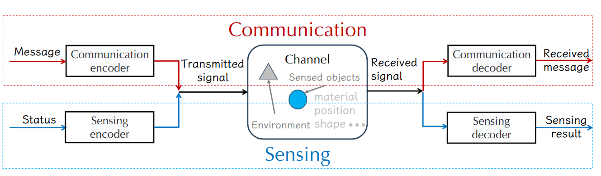
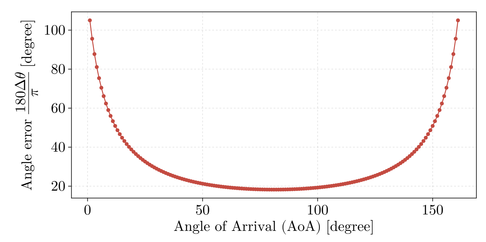
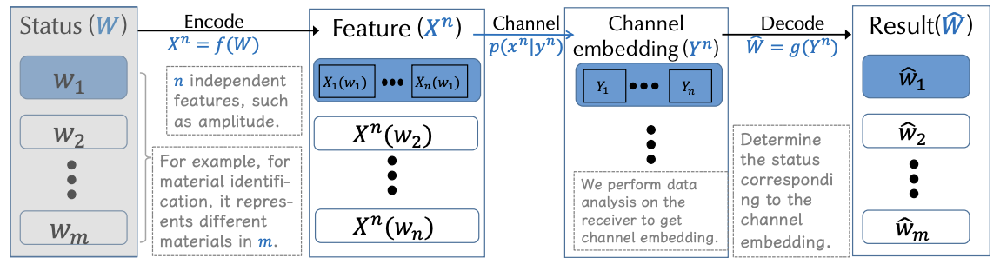
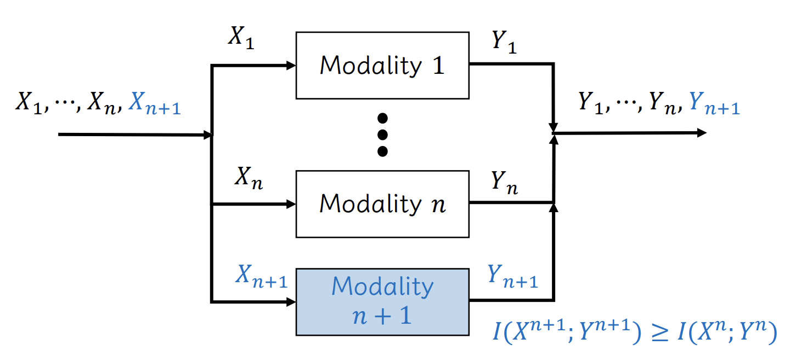
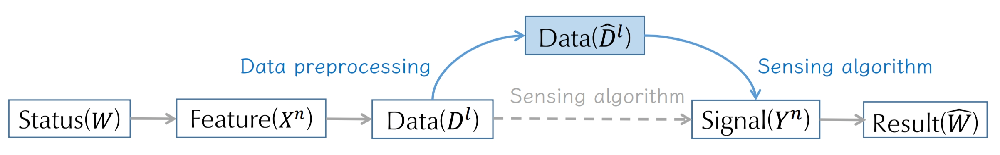
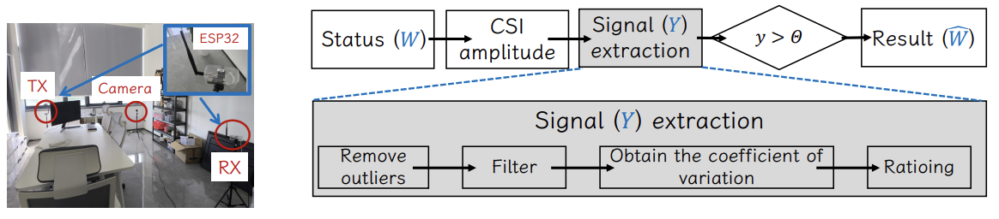
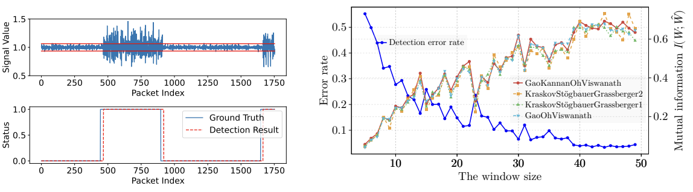
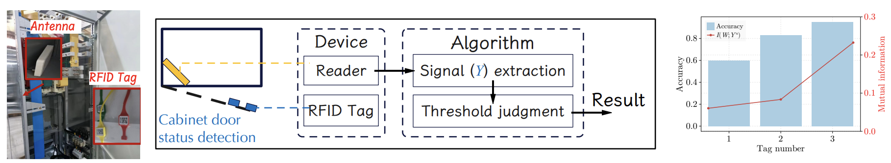
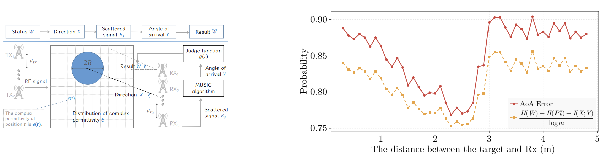

## Background

ISAC has been conceptualized, designed, and optimized for making communication and sensing functions complementary to each other.
The different goals bring the inherent [trade-off]{.alert} between communication and sensing performance when integrating them together.

{fig-align="center"}

## Motivation

::: {.callout-note}
## The ISAC system can be formulated by 

$$\mathbf{Y}=\mathbf{H}\mathbf{X}+\mathbf{N},$$

 where $\mathbf{Y}$ is the received signal, $\mathbf{X}$ is the transmitted signal, $\mathbf{H}$ is the channel status, and $\mathbf{N}$ is the noise that might be introduced by sensed objects.
:::

Intuitively, the system sensing capability can be evaluated by analyzing how the received signals reflect the channel status, such as sensing [mutual information]{.alert} $I(\mathbf{H};\mathbf{Y})$.

## Motivation

#### Howerve, it doesn’t work well for the following two reasons.

- The relationship between the sensing capability of such features and the signal itself is ambiguous.

- The sensing capability analysis must be designed to operate for all possible types.

{fig-align="center"}

# What do we do?

In this paper, we propose a general sensing channel encoder model to help determine the sensing capability – the upper
bound and lower bound of error in restoring the sensed object from given wireless signal features.

## Model definitions

A typical sensing process often comprises several components: the [target status]{.alert} to be sensed ($W$), the [feature]{.alert} ($X^n$) designed to sense the status, the sensing [channel embedding]{.alert} ($Y^n$) obtained through the sensing system, and the [result]{.alert} ($\hat{W}$) derived after processing the signal.

  

## Model definitions

:::{.callout-note}
## DTMI
The discrete task mutual information (DTMI) is defined as the mutual information between the feature $X^n$ and the channel embedding $Y^n$, i.e., $I(X^n;Y^n)$.
:::

::: {.fragment}
:::{.callout-note}
## Conditional error probability
The conditional error probability  $\xi _i$ when the target status is $w_i$ is defined as:
	$$
		\xi _i = \Pr(\hat{W}\neq w_i|W=w_i).
		\label{eq:lambda_i}
	$$
:::
:::

::: {.fragment}
:::{.callout-note}
## Expected value of the error
The expected value of the error, denoted as $P_E^{n}$, is articulated as follows:
	$$
		P_E^{n} = \sum_{i=1}^{m} p(w_i)\xi _i.
		\label{eq:error}
	$$
:::
:::

## Bound

:::{#imp-lowbound .callout-important}
### Lower bound
For a sensing task $W$ with $m$ statuses, we use $n$ independent features to describe the status of the target.
	The expected value of the error $P_E^{n}$ satisfies the following lower bound:
	$$
		P_E^{n}+ \frac{H(P_E^n)}{\log m}\geq \frac{H(W)-I(X^n;Y^n)}{\log m},
		\label{eq:lowbound}
	$$
	where $H(P_E^n)=-P_E^n \log P_E^n - (1-P_E^n)\log(1-P_E^n)$.
:::

:::{#imp-upbound .callout-important}
### Up bound

For a sensing task with $m$ statuss, we use $n$ independent features to describe the status of the target.
	For sufficiently large $n$, the expected value of the error $P_E^{n}$ satisfies the following upper bound:
	$$
		P_E^{n}\leq \varepsilon + \sum_{k=1}^m p(w_k) \sum_{j\neq k}^m 2^{3n\varepsilon-\sum_{i=1}^n I(X_i(w_j);Y_i(w_k))}
		\label{eq:upbound}
	$$
:::

# Corollary

Previous excellent sensing systems have summarized many valuable experiences, such as multi-modal systems tend to achieve better sensing [performance]{.alert}. However, these experiences currently lack theoretical explainability. In this section, we employ sensing channel encoder model and DTMI as tools to attempt to [explain]{.alert} some classic phenomena.

## Why do multimodal systems tend to exhibit superior performance?

Many previous research works have shown that using multi-modality for sensing helps achieve better performance, which can be explained by the theorem we proved previously.

{fig-align="center"}

## How do we compare which of two sensing features is better?

In this paper, we propose [DTMI]{.alert} which can reflect the performance of sensing features to a certain extent.
Specifically, we consider two features $X$ and $X'$.
After passing through the sensing channel, their corresponding channel embeddings are $Y$ and $Y'$, respectively.
According to @imp-lowbound and @imp-upbound, both the upper and lower bounds of the expected error are related to the DTMI.
If the DTMI $I(X;Y)>I(X';Y')$, the upper and lower bounds of the expected value of the error $P_E$ will be reduced, which means that it is easier to achieve good performance using $X$ as sensing features.

[This necessitates alternative approaches, beyond experimental validation, to assess the performance of designed sensing features.]{.alert}

## Is data pre-processing a "cure-all" solution?

If the following equation holds,
$$
        H(W)-I(X^n;D^l) > 1,
$$
lossless sensing cannot be achieved simply by improving the effect of data preprocessing.

## Case study

### Human detection based on WiFi devices.

  

## Case study

### RFID-based electrical cabinet door direction monitoring.

Given the cost-effectiveness and ease of deployment of RFID tags, we have developed an algorithm for monitoring cabinet door status using multiple tags.
Furthermore, we employ the mutual information of tasks, as proposed in this paper, to assess the system’s performance.

## Direction estimation based on Music algorithm and electromagnetic signal.

  

