## 论文信息

```bibtex
@ARTICLE{9585321,
  author={Zhang, J. Andrew and Rahman, Md. Lushanur and Wu, Kai and Huang, Xiaojing and Guo, Y. Jay and Chen, Shanzhi and Yuan, Jinhong},
  journal={IEEE Communications Surveys & Tutorials}, 
  title={Enabling Joint Communication and Radar Sensing in Mobile Networks—A Survey}, 
  year={2022},
  volume={24},
  number={1},
  pages={306-345},
  doi={10.1109/COMST.2021.3122519}
  }
```

## 背景 {.smaller}
集成C & S系统的最初概念可以追溯到20世纪60年代，并且主要用于开发多模式或多功能军用雷达。在早期，大多数此类系统属于具有分离波形的C & S类型。关于国内系统2010年的JCAS的研究有限。在过去的十年中，JCAS的研究基于简单的点对点通信，如车载网络和复杂的移动/蜂窝网络。前者可以在自动驾驶中找到很好的应用，而后者可能会彻底改变当前仅通信的移动网络。

JCAS具有将无线电感知集成到大规模移动网络中的潜力，创造了我们所说的感知移动网络 (pmn)。通过 “感知”，我们指的是通过无线电视觉和对现有移动网络的推断来感知环境的附加能力。这种感知可以远远超出定位和跟踪，使移动网络能够 “看到” 和理解环境。从当前的移动网络发展而来，[PMN有望充当无处不在的辐射感应网络，同时提供不妥协的移动通信服务。]{.alert}它可以建立在现有的移动网络基础设施之上，而无需对网络结构和设备进行重大更改。它将释放移动网络的最大能力，并避免构建单独的广域无线电感知网络的高昂基础设施成本。在大的覆盖范围的情况下，集成的通信和感知能力有望实现许多新的应用，对于这些应用，当前的感知解决方案要么不切实际，要么成本太高。

## 背景

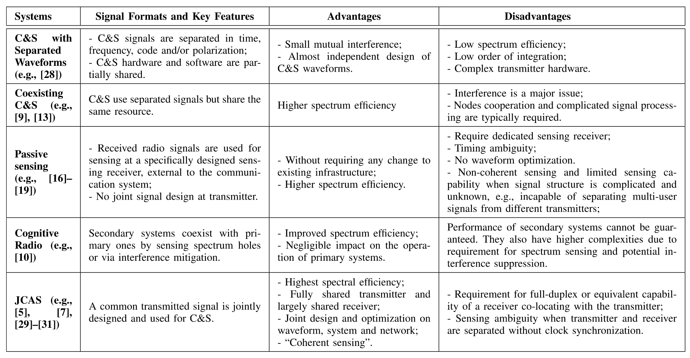{fig-align="center"}

## 潜在应用

大规模感知对于我们的工业和社会的发展变得越来越重要。
它是颠覆性物联网应用和各种智能计划 (如智能城市和智能交通) 的关键推动者。

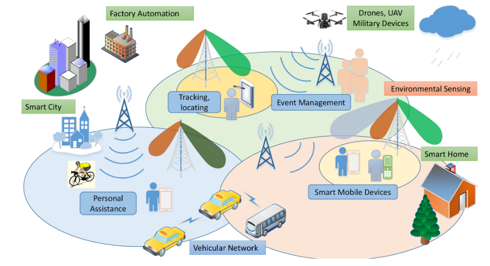{fig-align="center"}

## 基本分类

::: {.columns}

::: {.column width="50%"}
- 以雷达为中心的设计: 在主雷达系统中实现通信功能 (或将通信集成到雷达中); 
- 以通信为中心的设计: 在主通信系统中实现无线电/雷达感知功能 (或将雷达集成到通信中); 
- 联合设计和优化: 不受底层系统和信号约束的技术
:::

::: {.column width="40%"}
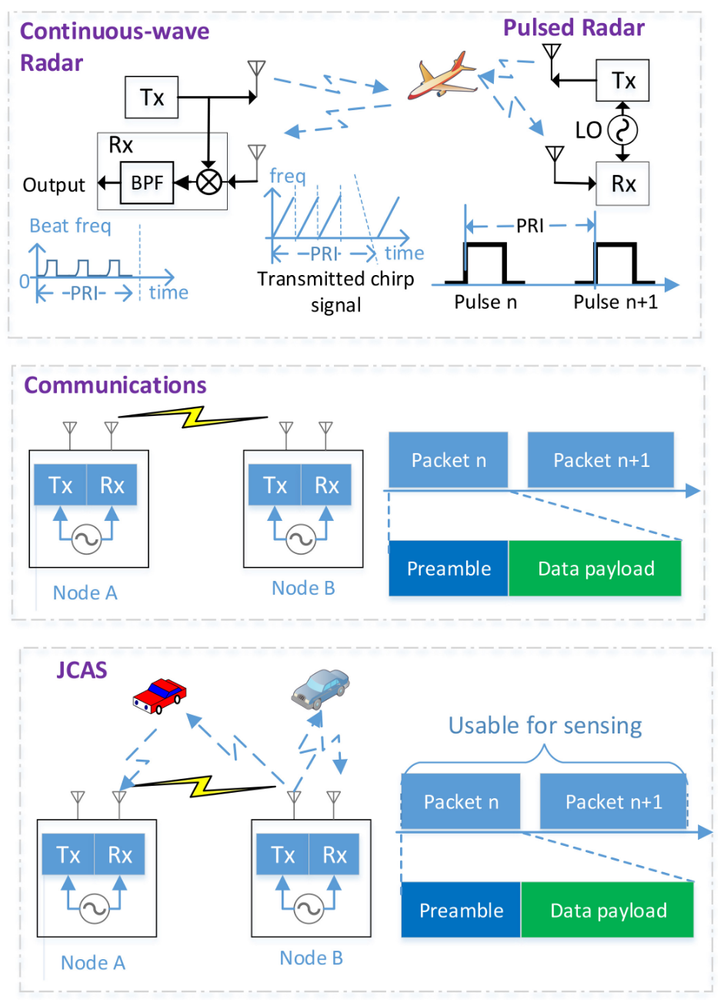{fig-align="center"}
:::

:::

## 基本分类

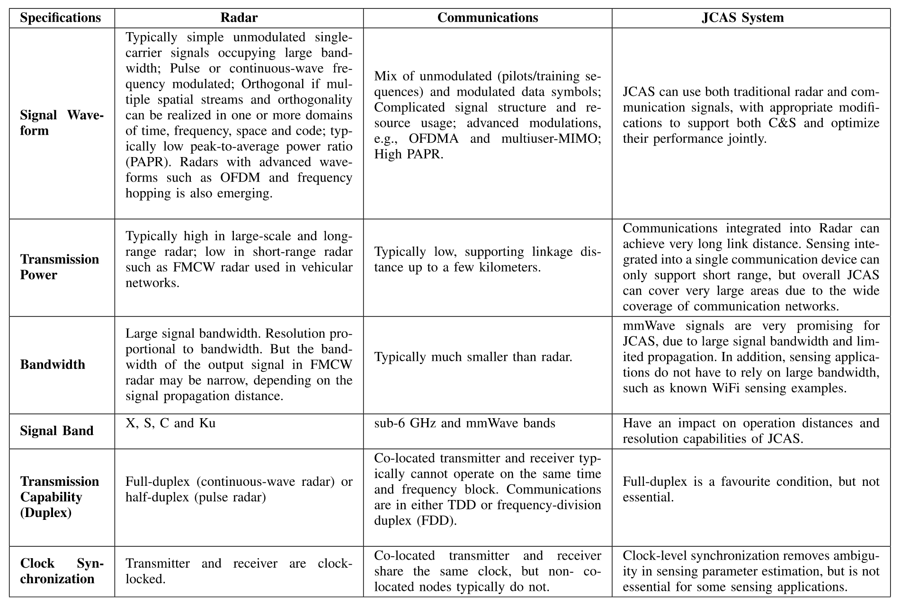{fig-align="center"}

## 以通信为中心的设计: 在主要通信系统中实现感知

将感知集成到通信中的两个基本问题是：

- 如何在感知接收器和发射器位于同一位置的单静态设置中实现全双工操作

- 如何在双静态或多静态设置中去除由于空间分离的发射器和 (感知) 接收器之间的通常未锁定的时钟而引起的时钟异步影响。

## 没有基础系统的联合设计 {.smaller}

可以开发JCAS技术而不限于现有的通信或雷达系统。从这个意义上讲，[可以通过考虑通信和感知的基本要求来设计和优化它们，从而可能在两个功能之间提供更好的折衷。]{.alert}
毫米波和 (亚) 太赫兹波JCAS系统是促进这种联合设计的很好的例子。一方面，毫米波和太赫兹信号具有大带宽和短波长，为高速率通信和高精度感知提供了巨大的潜力。另一方面，毫米波和太赫兹系统正在兴起。它们尚未得到广泛部署，太赫兹系统的标准尚未开发。毫米波和太赫兹JCAS可以促进许多新的令人兴奋的应用，包括室内和室外。关于毫米波JCAS的现有研究已经证明了其在室内和车载网络中的可行性和潜力。作者 ^[Toward millimeter-wave joint radar communications: A signal processing perspective] 提供了基于mmwave的JCAS的深入信号处理方面，重点是JCAS系统的波形设计。有工作^[Future millimeter-wave indoor systems: A blueprint for joint communication and sensing] 设想了未来用于室内感知的毫米波JCAS。mmWave JCAS系统的混合波束成形设计进行了研究 ^[Hybrid beamforming with sub-arrayed MIMO radar: Enabling joint sensing and communication at mmWave band] 。研究者 ^[Adaptive virtual waveform design for millimeter-wave joint communication–radar] 设计了一种自适应毫米波波形结构。研究者 ^[A mmWave automotive joint radar-communications system] 研究了汽车应用的JCAS波形的设计和选择，其中通过分析系统模型并列举设计参数的影响，提供了相位调制连续波JCAS和基于OFDMA的JCAS波形之间的比较。研究者 ^[Multibeam for joint communication and radar sensing using steerable analog antenna arrays] ^[Optimization and quantization of multibeam beamforming vector for joint communication and radio sensing] 开发了多波束技术，以允许使用公共传输信号在不同方向进行C & S。波束成形向量被设计和优化以实现快速波束更新并实现C & S之间的平衡性能。研究者 ^[Terahertz-band joint ultra-massive MIMO radar-communications: Model-based and modelfree hybrid beamforming] 研究了太赫兹大规模MIMO JCAS系统的波束成形设计。

## JSAC 系统的优势

- 频谱效率: 理想情况下，通过完全共享可用于无线通信和雷达的频谱，频谱效率可以增加一倍; 
- 波束成形效率: 波束成形性能可以通过利用从感知获得的信道结构来提高，例如，快速波束适应信道动态和波束方向优化;
- 降低成本/尺寸: 与两个分离的系统相比，联合系统可以显着降低收发器的成本和尺寸；
- C & S的互惠互利: C & S可以通过整合相互受益。通信链路可以在用于感知的多个节点之间提供更好的协调; 并且感知向通信提供环境感知，具有改进的安全性和性能的潜力。

# Framework for a PMN

## 系统平台和基础设施

根据网络设置，我们描述了可以实现JCAS的两种类型的拓扑，即云无线电接入网络 (CRAN) 和独立BS。

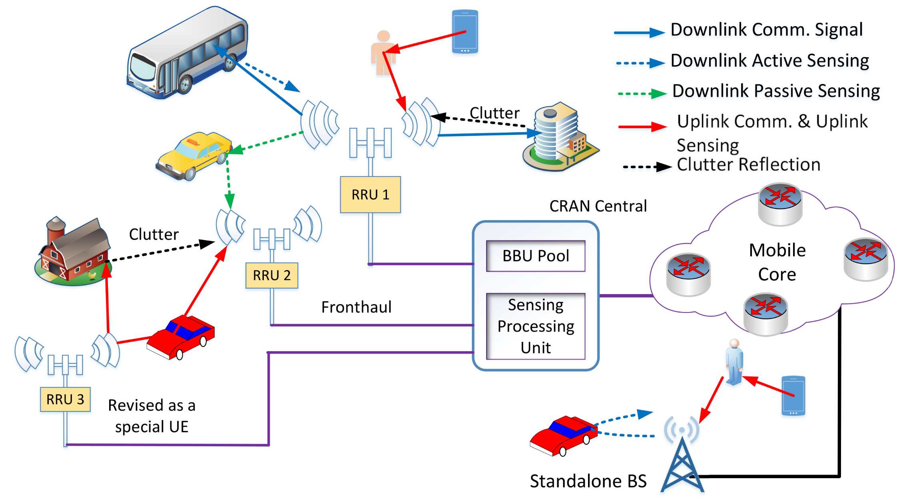{fig-align="center"}

## 系统平台和基础设施

### CRAN

典型的CRAN由一个中央单元和多个分布式天线单元组成，这些单元称为远程无线电单元 (rru)。Rru通常经由光纤连接到CRAN中心。量化的射频信号或基带信号可以在rru和中央单元之间传输。在CRAN的PMN中，密集分布的rru由中央单元协调，为ue提供通信服务。对于C & S两者，由CRAN中心收集和处理它们从它们自身、其它rru或从ue接收的信号。CRAN中央单元托管用于处理通信功能的原始基带单元 (BBU) 池和用于感知的新感知处理单元。此设置与分布式雷达系统的拓扑结构一致。

## 系统平台和基础设施

### Standalone BS

CRAN拓扑对于在pmn中实现感知不是必需的。独立BS还可以使用来自其自己的发送信号或来自ue的接收信号来执行感知。这实际上是文献中广泛考虑的典型且更简单的设置。这种设置包括可以部署在家庭中的小型BS，这推动了边缘计算和感知的概念。像WiFi感知^[A survey on behavior recognition using WiFi channel state information]一样，这样的小BS可以用于支持室内感知应用，例如跌倒检测和房屋监视。它还包括一个路边单元 (RSU)，它是移动网络的一部分，但专门用于支持车辆通信^[Bayesian predictive beamforming for vehicular networks: A low-overhead joint radar-communication approach]。

## 三类典型的感知

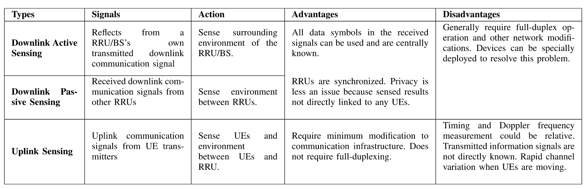{fig-align="center"}

## Summary and Insights

- PMN可以从当前的移动网络演进，其中在网络侧或UE侧实现感知。网络侧感知具有更高的处理能力和更好的信息访问的优点，因此是优选的。它可以在一个独立的BS中实现，也可以在多个BS或rru中以协作的方式实现；
- 在PMN中可以实现三种类型的感知: 使用下行链路通信信号的下行链路有源和无源感知，以及使用上行链路通信信号的上行链路感知。三种类型的感知操作的比较。它们可以单独实现，也可以一起实现；
- 几乎所有的通信信号都可以用于感知，具有各自的优点和缺点。表IX中提供了三种类型的这种信号的比较。总的来说，参考信号 (诸如用于通信中的信道估计的DMRS信号) 通常具有用于感知的最佳属性。但是，当需要更多信号时，数据有效载荷和同步信号块可以被使用。由于不同的属性以及因此对感知的不同性能影响，需要仔细规划和优化这些信号用于感知的组合使用。

# 主要的挑战

## 从复杂的移动信号中提取感知参数

移动网络的复杂信号结构使得pmn中的感知参数估计具有挑战性。现代移动网络是一种复杂的[异构网络]{.alert}，连接着不同的设备，这些设备占用了在时间、频率和空间上交错和不连续的交错资源。由于多用户接入、多样化和分散的资源分配以及空间复用，移动信号也非常复杂。也用于感知的通信信号是使用多用户MIMO和OFDMA技术随机调制的，并且可以针对每个用户分段-在时间、频率或空间上不连续。
由于这种信号结构，大多数现有的感知参数估计技术不能直接应用于pmn。例如，有源雷达感知技术主要传输线性调频 (LFM) 调制发射信号; 大多数无源双静态和多静态雷达考虑简单的单载波和OFDM信号。

感知参数描述了信号在环境中的传播以及信道的详细组成。它们通常具有连续但不具有离散值。因此，大多数现有的信道估计和定位算法也不能直接应用。

## 联合设计与优化

JCAS以及pmn中的一个关键研究问题是如何联合设计和优化C & S的信号和系统。许多研究已经调查了波形和基本信号参数对关节系统性能的影响。这样的波形和系统参数优化可以导致独立系统中的性能改进，但是与处于高级 (即，系统和网络级别) 的那些相比，其具有较小的影响。C & S在系统和网络级别有非常不同的要求。例如，在多用户MIMO通信系统中，发射的信号是多用户随机符号的混合，而理想的MIMO雷达感知信号是未调制且正交的。当使用阵列时，雷达感知侧重于优化虚拟子阵列的形成和结构，以增加天线孔径，然后提高分辨率，但通信强调波束成形增益和方向性。这种冲突的要求可能使联合设计和优化非常具有挑战性。需要更多的研究来利用共性并抑制两个功能之间的冲突。另一个重要问题是[C & S如何通过整合从彼此中获益更多。这一点远未得到很好的理解]{.alert}。目前的研究仅限于传播路径优化和安全通信。

## 网络感知

将感知集成到移动通信网络中提供了在蜂窝结构下进行无线电感知的巨大机会。然而，关于蜂窝拓扑下的感知的研究仍然非常有限。用于通信的蜂窝结构被设计为极大地增加频率重用因子，从而提高频谱效率和通信容量。蜂窝感知网络直观地还增加了频率重用因子，并且因此增加了总体 “感知” 容量。一方面，[这种蜂窝感知网络几乎没有已知的性能界限]{.alert}，除了有限数量的稍微相关的工作，例如共存雷达和蜂窝通信系统的性能分析和使用干扰OFDM信号的雷达感知。另一方面，尽管存在关于分布式雷达和多基站雷达的研究，但是考虑和利用蜂窝结构的感知算法 (诸如共小区干扰、节点协作以及基站上的感知切换) 仍有待开发。挑战在于如何解决蜂窝拓扑下不同基站之间的竞争与合作，以实现网络感知的性能表征和算法开发。

# Detailed Tehnologies and Open Research Problems

## 性能界限 

[有两种类型的性能界限可用于表征pmn中感知的性能界限。一种是基于互信息 (MI)，另一种是基于感知参数的估计精度，例如cramer-rao下界 。]{.bg style="--col: #ef7a82"}

MI ^[Mutual information based radar waveform design for joint radar and cellular communication systems] 可以用作测量雷达和通信性能的工具。具体地，对于通信，可以采用无线信道和接收的通信信号之间的MI作为波形优化准则，而对于感知，使用感知信道和感知信号之间的条件MI^[Information theory and radar waveform design] ^[Information-theoretic optimal radar waveform design]。因此，用于感知的MI测量关于信道、传播环境的多少信息被传送到接收器。因此，最大化MI对于更依赖于特征信号提取而不是感知参数估计的感知应用 (例如，用于目标识别) 特别有用。MI和容量的使用对于通信社区是众所周知的。

## 性能界限 {.smaller}

让我们考虑简化的信号模型来说明MI的公式。$\mathbf{H}_s$ 和 $\mathbf{H}_c$ 分别标识感知信道和通信信道，$\mathbf{Y}_s$ 和 $\mathbf{Y}_c$ 是接收到的感知信号和通信信号。令 $\mathbf{X} = f(\mathbf{S})$ 是发射信号，其中 $\mathbf{S}$ 是信息符号, 函数 $f$ 可以是线性或者非线性的。当使用空间预编码矩阵 $\mathbf{P}$ 代替 $f$ 时，接收信号可以被表示为：

$$\begin{aligned}\mathbf{Y}_{s}&=\mathbf{H}_{s}\mathbf{PS}+\mathbf{Z};\\\mathbf{Y}_{c}&=\mathbf{H}_{c}\mathbf{PS}+\mathbf{Z},\end{aligned}$$

通信和感知的MI表达式可以表示为：

$$I(\mathbf{H}_s;\mathbf{Y}_s|\mathbf{X})=h(\mathbf{Y}_s|\mathbf{X})-h(\mathbf{Z}),\text{ for sensing;}\\I(\mathbf{S};\mathbf{Y}_c|\mathbf{H}_c)=h(\mathbf{Y}_c|\mathbf{H}_c)-h(\mathbf{Z}),\text{ for comm.}$$ 

JCAS系统的MI已在一些出版物中进行了研究和报告。它们通常通过联合优化两个MI表达式及其在上式中的变化来进行。研究者 ^[Radar mutual information and communication channel capacity of integrated radar-communication system using MIMO] 的工作为JCAS系统制定了雷达互信息和通信信道容量，并提供了初步的数值结果。此外，研究者 ^[Mutual information based radar waveform design for joint radar and cellular communication systems]通过最大化MI表达式研究了JCAS系统的雷达波形优化。研究者 ^[Robust OFDM integrated radar and communications waveform design based on information theory]还通过最大化JCAS系统中雷达检测的通信数据速率和条件互信息的加权和，提出了一种优化的OFDM波形。


## 性能界限

CRLB是一种更传统的度量，已广泛用于表征雷达中参数估计的下限 ^[Cramer Rao bound on target localization estimation in MIMO radar systems]。对于PMN，在使用UMTS (3g) 窄带移动信号的无源感测场景中，报告 ^[CramérRao bounds for UMTS-based passive multistatic radar] 了关于CRLB的最接近的工作。然而，CRLB表达式并不总是以闭合形式可用，特别是对于mimo-ofdm信号，主要是因为接收信号是感测参数的非线性函数。因此，尽管可以找到它们并对其进行数值评估，但CRLB度量不容易应用于分析优化。将它们与另一个成本函数一起应用于优化甚至更加困难。

## 波形优化

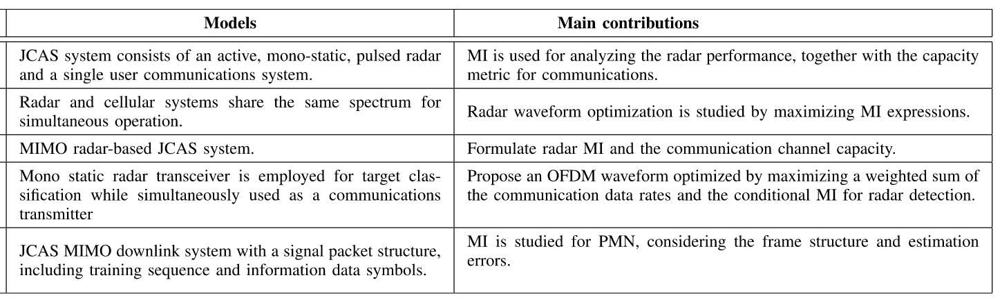{fig-align="center"}


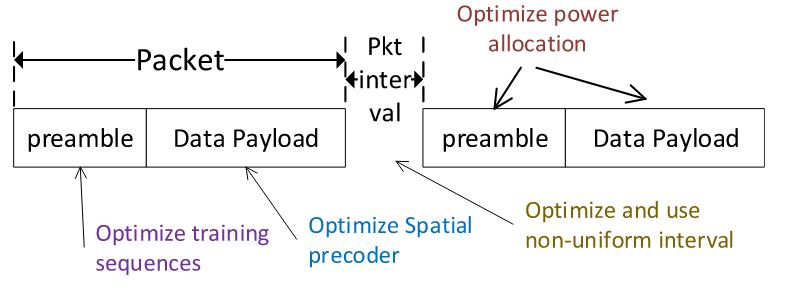{fig-align="center"}

## 波形优化

### 空间优化

对于关于pmn中的预编码矩阵 $\mathbf{P}$ 的空间优化。

- 一种方法是优化信号转换函数 $f (\cdot)$，以使发送信号X的统计特性最适合于C & S。
- 另一种方法是将感测波形添加到基础通信波形，同时考虑用于目的地节点的两个波形的相干组合。

## 波形优化 {.smaller}

### 空间优化

在第一种方法中，当优化是关于空间预编码矩阵时，[其被设计为改变所发送的信号的统计特性]{.alert}。该方法特别适用于为C & S联合制定的成本函数的全局优化。基本优化公式如下:

$$\begin{aligned}\arg\max_{{\mathbf{P}}}&&\lambda(\mathbf{P}),\\\mathrm{subject~to}&&\text{Constraints} 1,2,\cdots,\end{aligned}$$

其中 $\lambda (\mathbf{P})$ 是目标函数。在定义目标函数和约束时可以有各种方法和组合。每个可以用于通信或单独感测，或加权联合函数。一些示例如下。在^[Toward dual-functional radar-communication systems: Optimal waveform design]中，在多用户MIMO下行链路通信的信号干扰噪声比 (SINR) 的限制下，通过最小化生成的信号与期望的感测波形之间的差异来实现波形优化。进一步利用多目标函数来权衡生成的波形与所需波形之间的相似性  ^[MU-MIMO communications with MIMO radar: From co-existence to joint transmission,”]。在 ^[Multiobjective optimal waveform design for OFDM integrated radar and communication systems] 中，提出了自适应加权最优和帕累托最优波形设计方法，以同时提高距离和速度的估计精度以及通信信道容量。在 ^[Adaptive OFDM integrated radar and communications waveform design based on information theory] 中，通过考虑涉及通信容量和crlb的多目标函数来优化OFDM系统中子载波的加权向量，以用于感测参数的估计。该方法的一个主要缺点是，一旦通信或感测设置改变，就需要优化或重新设计预编码矩阵。

## 波形优化 {.smaller}

### 空间优化

在第二种方法中，可以预先为C & S中的一个或两个设计基本波形，然后以联合优化C & S性能的方式将两个波形相加。基本思想可以用数学表示如下:

$$\begin{aligned} & \arg\max_{\alpha, \mathbf{P}_c, \text{or} \mathbf{P}_s} \quad & \lambda (\mathbf{P}), \\
& \text{subject to} \quad &\text{Constraints} 1,2,\cdots\end{aligned}$$

其中 $\mathbf{P}_c$ 和 $\mathbf{P}_s$ 分别是主要针对通信和感测的预编码矩阵，并且 $\mathbf{P}$ 是 $\mathbf{P}_c$ 和 $\mathbf{P}_s$ 的函数。例如 $\mathbf{P} = \alpha \mathbf{P}_c + (1 − \alpha) \mathbf{P}_s$，其中 $\alpha$ 是复数标量。该方法对于使用定向波束成形的毫米波系统特别有用。一个例子是可从 ^[Multibeam for joint communication and radar sensing using steerable analog antenna arrays,]，其中多波束的方法提出灵活地产生通信和传感子波束使用模拟天线阵列。在 ^[Optimization and quantization of multibeam beamforming vector for joint communication and radio sensing] ^[Multibeam optimization for joint communication and radio sensing using analog antenna arrays] 中进一步研究了组合两个子光束的优化。当然，多波束的效率与C & S的要求有关。根据 ^[Millimeter-Wave for 5G: Unifying Communication and Sensing]，获得正确的解决方案的波束转向和波束宽度适应JCAS操作高度依赖于环境背景。实际上，反射器位置、阻挡高度、运动速度和其他环境背景因素可能对多波束方法的效率具有显著影响。

## 波形优化 {.smaller}

### 时域和频域

优化可以是关于帧结构、子载波占用、功率分配和导频设计的，并且通常需要移动信号的一些轻微改变。可以关于信号格式和资源分配两者来优化帧中的前导码部分。典型的通信帧由前导码和数据有效载荷组成，并且在蜂窝网络中，它们经由逻辑信道来构造。前导通常包含未调制的和正交信号，其可以直接用于感测。对于mimo-ofdm信号，前导码信号的格式可以被设计为模仿传统的雷达波形，同时保持通信所需的属性。例如，在 ^[Waveform design for integration of MIMO radar and communication based on orthogonal frequency division complex modulation] 中，基于mimo-ofdm JCAS生成MIMO雷达中常用的正交线性调频 (LFM) 信号。还可以通过在mimo-ofdm雷达 ^[OFDM-MIMO radar with optimized nonequidistant subcarrier interleaving] 中结合非等距子载波的思想来设计前导码的子载波占用，以平衡C & R的性能。还可以优化前导码或导频的间隔以改善感测性能，同时保持通信效率。如果连续发送分组，则这也可以通过改变分组上的数据有效载荷的长度来实现。

## 波形优化 

### 利用下一代信令格式进行优化

大多数以通信为中心的JCAS系统已在信号载波或OFDM(A) 系统上制定，这与雷达中使用的那些波形一致。联合JCAS波形设计还可以应用于下一代通信信号，诸如正交时间-频率空间 (OTFS) ^[Radar sensing with OTFS: Embracing ISI and ICI to surpass the ambiguity barrier] 信令和快于奈奎斯特 (FTN) 调制。为了降低OTFS传感的传统高复杂度，在 ^[Low-complexity parameter learning for OTFS modulation based automotive radar] 中提出了一种有效的贝叶斯学习方案，以及通过结合真实目标的运动参数限制的先验知识来减少测量矩阵的维度。这些工作证明了OTFS JCAS系统的可行性和潜在效率。尽管没有OTFS JCAS的波形优化结果，但我们推测可以以类似于OFDM的方式进行。特别地，预编码可以在空间域之外更有效地应用，例如应用到延迟-多普勒域。

## 天线阵列设计

对于无线电感测，具有独立RF链的每个天线就像相机中的像素。但是无线电系统允许对发送和接收的信号进行更灵活的控制和处理。因此，除了用于波形优化的MIMO预编码之外，我们还可以对pmn中的天线阵列进行更多设计，如最后一个小节中所讨论的。表XIV中呈现了这些技术的分类，包括虚拟阵列设计、稀疏阵列设计和空间调制。下面详细说明这些技术。

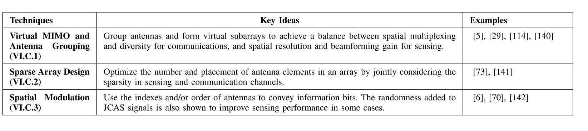  


## 天线阵列设计 {.smaller}

### 虚拟MIMO和天线分组
C & S之间的天线阵列设计存在许多矛盾的要求。波束成形和天线放置是两个很好的例子。对于波束成形，通常需要具有变化的波束成形和窄波束宽度的阵列来进行感测; 然而，在至少一个分组周期期间，通信需要固定且准确指向的波束以获得非时变信道，并且需要多波束以支持SDMA。对于天线放置，MIMO雷达通常需要特殊的天线间隔，以实现增加的虚拟天线孔径 ^[ Phased-MIMO radar: A tradeoff between phased-array and MIMO radars]; 而MIMO通信侧重于波束成形增益，空间分集和空间复用，因此，天线之间的低相关性更为重要。这些不同且矛盾的要求需要新的天线设计方法。一个潜在的解决方案是引入天线分组和虚拟子阵列的概念。通过将现有天线划分为两个或更多个组/虚拟子阵列，我们可以指定C & S的任务并优化跨天线组的设计。

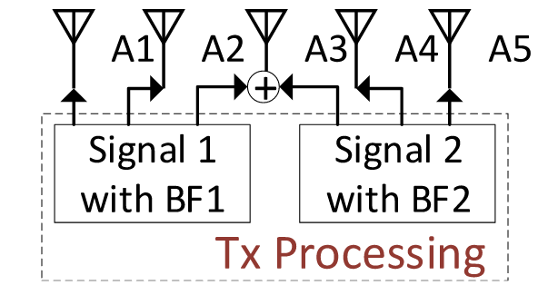{width=40%}


## 天线阵列设计 {.smaller}

### 稀疏阵列设计

除了天线分组之外，稀疏阵列设计是利用自由度的另一种方法，当天线的总数固定时，可以通过配置天线的位置来实现该自由度。
稀疏阵列或稀疏阵列的设计 ^[Synthesizing beam-scannable thinned massive antenna array utilizing modified iterative FFT for millimeter-wave communication]，例如共素阵列 ^[Directionof-arrival estimation for coprime array via virtual array interpolation]，通常被认为是最佳地将给定数量的天线放置在大量 (均匀) 网格点的子集上 ^[Sparse transmit array design for dual-function radar communications by antenna selection]。以这种方式，少量天线可以跨越具有高空间分辨率和低旁瓣的大阵列孔径。

稀疏阵列设计特别适用于具有数十到数百个天线但具有有限数量的RF链的大规模MIMO阵列，即开关阵列或混合阵列。这种设置可以在pmn中以降低的成本提供更多的自由度和潜在的性能增强。例如，稀疏阵列设计可以为通信部分添加索引调制; 而稀疏阵列设计可以为雷达探测提供更好的空间分辨率。为此，一些有趣的问题仍有待解决，例如如何制定满足两个目标的问题以及C & S之间的新权衡。


## 天线阵列设计 {.smaller}

### 空间调制

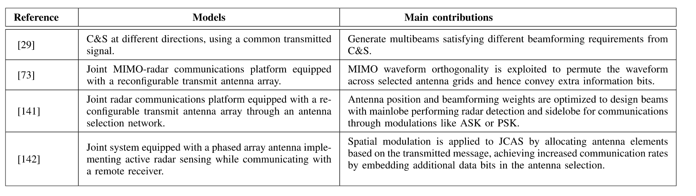{width=70% fig-align="center"}

空间调制使用一组天线索引来调制信息比特，并且已经针对通信系统进行了广泛的研究 ^[Super-resolution mmWave channel estimation for generalized spatial modulation systems]。对于多天线JCAS系统，也可以潜在地应用空间调制。在 ^[Accurate channel estimation for frequency-hopping dual-function radar communications] 中，利用类似于空间调制的概念来提高跳频MIMO DFRC系统中的通信数据速率。在 ^[Spatial modulation for joint radar-communications systems: Design, analysis, and hardware prototype] 中，通过根据传输的消息分配天线元件，将空间调制应用于JCAS，通过在天线选择中嵌入额外的数据位来实现增加的通信速率。尽管这些工作是基于脉冲和连续波雷达，但通过将天线选择添加到现有的时空调制中，它们可以潜在地扩展到PMN。特别地，PMN中的富散射环境提供空间信道之间的较低相关性，导致潜在的更好性能。


## 天线阵列设计 

### 可重新配置智能Surface辅助JCAS

可重构智能表面 (RIS) ，也称为可重构智能元表面或智能反射表面，可以被视为一种特殊类型的中继 “天线” 阵列，用于影响信号传播。环境对象涂有电磁和可重新配置的超表面的人造薄膜，可以对其进行控制以对无线电传播进行整形。RIS提供大量的空间自由度，其通常可以被建模为可调节的相移。使用RIS可以通过增加波束成形增益，减少干扰和减少衰落来显着提高通信性能; 它还可以通过生成位置相关的无线电指纹和定向感测来对感测产生显着影响。因此，为了分别改善雷达和通信的性能，对RIS进行了广泛的研究。尽管有限，但有关RIS辅助JCAS的研究正在兴起。

## Clutter Suppression Techniques

移动网络中的丰富多径为pmn中的感测参数估计带来了另一个挑战。在典型的环境中，bs接收源自永久或长周期静态对象的许多多径信号。这些信号对于通信是有用的，但是对于固定BS，它们通常对于连续感测是不感兴趣的，因为它们承载很少的新信息。这种不期望的多径信号在传统雷达文献中被称为杂波。在pmn中，如果多径信号在很大程度上保持不变并且在感兴趣的时间段内具有接近零的多普勒频率，则我们将其视为杂波。由于移动网络丰富的多径环境，接收到的信号中可能存在大量杂波。杂波包含很少的信息，最好从发送到感测参数估计器的信号中去除。

## Clutter Suppression Techniques 

::: {.columns}
::: {.column}
可以有两种杂波抑制方式，如图所示: 在估计感测参数之后或之前进行抑制。前者对传感参数估计不引入信号失真，后者可以减少待估计的未知传感参数。高端军用/家用雷达可以同时检测和跟踪数百个物体，并且该能力建立在先进的硬件上，例如成百上千个天线元件的巨大天线阵列。因此，两种方式都可以应用。
:::
::: {.column}
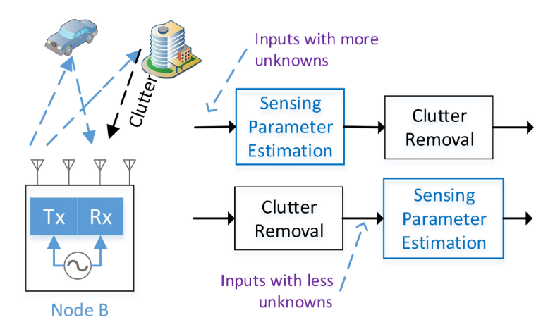  
:::
:::

## Sensing Parameter Estimation {.smaller}

Pmn中的感测任务既包括用于定位对象和估计其移动速度的感测参数的显式估计，又包括面向应用的模式识别，例如对象和行为识别和分类。

我们注意到，传感参数估计是非线性问题，因此无法应用已广泛用于通信信道估计的大多数经典线性估计器。典型的传感参数估计技术可以分类如下: 周期图，例如2D DFT，基于子空间的频谱分析技术，网格上压缩传感 (CS) 算法，离网CS算法和网格致密化以及张量工具。这些技术中的大多数具有比经典信道估计算法更高的复杂度。由于所需的感测速率通常在几毫秒到几秒的量级，因此在bs处可以承受这种高计算复杂度。

::: {.columns}
::: {.column width=55%}
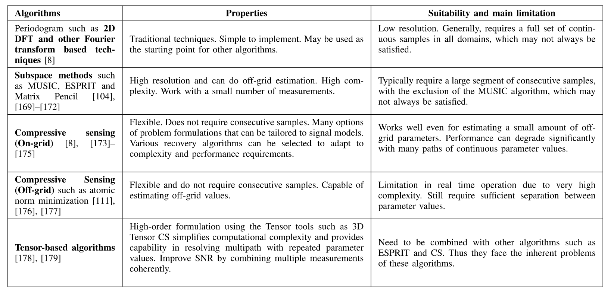  

:::
::: {.column width=45%}
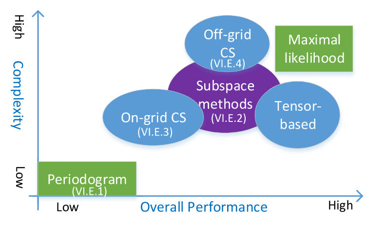  

:::
::: 

## Resolution of Sensing Ambiguity

在pmn中，特别是在上行链路感测中，感测接收器和发送器之间通常没有时钟级同步。在这种情况下，在接收信号中存在定时和载波频率偏移。由于振荡器稳定性，它们两者通常是时变的。在通信中，定时偏移可以被吸收到信道估计中，并且CFO可以被估计和补偿。它们的残差变得足够小，可以忽略。不同地，在感测中，它们引起测量模糊性和准确度降级。定时偏移可以直接引起定时模糊性，然后引起测距模糊性，并且CFO可以引起多普勒估计模糊性，然后引起速度模糊性。它们还防止聚合来自不连续分组的信号以用于联合处理，因为它们引起跨分组或CSI测量的未知和随机相移。因此，解决时钟定时偏移问题非常重要。如果它被解决，则可以有效地实现上行链路感测，需要网络基础设施的很少改变。

## Pattern Analysis

使用无线电信号，通过结合机器学习和信号处理技术，可以实现面向应用程序的高级对象，行为和事件识别和分类。可以使用或不使用提供位置和速度信息的感测参数估计结果来实现它们。

尽管使用移动信号进行模式分析的工作仍处于起步阶段，但我们已经看到了一些有趣的例子。正如我们从许多成功的WiFi传感应用中观察到的那样，我们可以预见它在不久的将来会蓬勃发展。使用WiFi信号进行对象和行为识别和分类已得到很好的证明。pmn具有比WiFi系统更先进的基础设施，包括更大的天线阵列、更强大的信号处理能力以及分布式和协作节点。使用大规模MIMO，pmnbs等同地拥有大量用于感测的 “像素”。它能够一次解析多个物体，并以更好的视野和分辨率获得成像结果，就像光学相机一样。

## 蜂窝拓扑下的网络感知 {.smaller}

mn为蜂窝结构下的无线电感测提供了巨大的机会，这可能远远超出分布式雷达系统的规模和复杂性。蜂窝拓扑下的联网传感的主要挑战仍然是解决不同节点之间的竞争和合作以进行传感性能表征和算法开发的方式。目前这方面的研究几乎是空白。在这里，我们设想了两个潜在的研究方向。

- “细胞传感网络” 的基本理论和性能界限: 这是关于研究细胞结构在提高频谱效率和传感性能方面的潜力，并为这种改进开发基本理论和性能界限。类似于通信，蜂窝网络也直观地增加了频率重用因子，并因此增加了用于感测的总体 “容量”。随机几何模型可能是用于分析感测网络中的动态的优秀工具，如在 ^[Stochastic geometry methods for modeling automotive radar interference] 中已应用于表征自主车辆网络中的聚集雷达干扰。

- 利用节点分组和协作的分布式感测: 利用联网感测的一种方式是通过对ue进行调度和分组来开发分布式和协作感测技术，并且实现rru之间的协作。一方面，现有的研究表明，分布式雷达技术可以通过提供大的空间多样性和宽角度观测来提高位置分辨率和运动目标检测。可以通过优化波形设计和雷达节点的放置来最大化这种多样性。在pmn中，我们可以对多个ue的感测结果进行分组以改善上行链路感测。另一方面，分布式雷达可以实现高分辨率定位，利用来自不同分布式节点的载波信号的相干相位差 。这需要雷达节点之间的相位同步，并且只能通过对rru进行分组在下行链路感测中潜在地实现。对于这两种情况，我们都可以开发分布式传感技术，利用对分布式波束成形和协作通信的广泛研究工作。在 ^[Cooperative detection by multi-agent networks in the presence of position uncertainty,] 中描述了合作检测和定位/感测的一个示例，其中提出了基于广义似然比测试检测器的合作目标检测方案。

## Sensing-Assisted Communications

当通信和传感集成时，重要的是要了解它们如何相互受益。在pmn的上下文中，可以利用至少以下技术来改进使用感测结果的通信: 感测辅助波束成形和安全通信。

## Sensing-Assisted Communications {.smaller}

### 感知辅助波束成形

波束成形是用于在某些方向上集中传输以实现高天线阵列增益的重要技术，并且对于毫米波系统至关重要。然而，由于窄波束宽度，一旦LOS传播信道被阻塞，在毫米波通信系统中找到正确的波束成形方向并更新指向方向通常是耗时的。已经提出了利用sub-6GHz信号的传播信息来提高移动网络中毫米波通信的波束成形速度的技术。这些技术利用了两个频带的信道之间的空间相关性，然而，这是特定于地点的，并且由于环境动态而需要实时更新。由于两个频带之间的信号波长的巨大差异，转换也可能是不准确的。相比之下，使用在类似毫米波频段工作的雷达可以潜在地提供详细的传播信息，这对于波束成形更新和跟踪是理想的。

尽管上述工作证明了PMN中感测辅助波束成形的可行性和潜力，但仍有一些主要问题有待解决以使其实用。一个问题是如何将感测结果转化为波束成形设计。特别地，下行链路感测结果与对象相关联，而通信信道与对象的天线相关联。给定车辆的大小，它们之间可能会有很大的偏移。另一个问题是如何处理多重反射。当存在来自不同方向的多个反射时，信号的相位也将在波束形成中起重要作用，但是它们通常不能在雷达感测中被准确地估计。这两个问题的一个潜在解决方案是在PMN中组合上行链路和下行链路感测。下行链路感测可以为初始波束成形提供快速和粗略的信息，而上行链路感测可以在复杂的传播环境中提供更详细和准确的信息。

## Sensing-Assisted Communications {.smaller}

### 传感辅助安全通信

无线电传感为周围环境中的有源发射器和无源物体提供了信息通道组成。这种详细的信道信息可以用于安全的无线通信，对此的研究仍处于起步阶段。

详细信道构成信息的一个重要运用是在物理层平安技巧中。当前的物理层安全研究主要基于信道状态信息 ^[A survey on wireless security: Technical challenges, recent advances, and future trends]，使用例如人工噪声辅助的、面向安全的波束成形和物理层密钥生成方法。在 ^[Secure radar-communication systems with malicious targets: Integrating radar, communications and jamming functionalities] 中已经尝试了这一点，其中采用人工噪声方法在JCAS系统中实现安全波束成形，以对抗窃听者。基于CSI的物理层密钥生成已被广泛研究，并且被证明对于安全通信非常有效。然而，CSI的保密容量通常是有限的，因为它隐藏了信道传播细节并且是许多传播路径的总和。相比之下，感测结果包含关于一对发射器和接收器之间的环境的更重要的信息。它们可以激发蜂窝通信网络中提供更多信息的秘密密钥生成方法和协议。首先，我们可以表征pmn的保密能力，并开发用于信息加密的实用密钥生成方法