## 无线频谱的价格急剧上升
::: {.fragment .fade-in-then-semi-out}
- 韩国电信公司为5g网络的两个频段 (3.5 GHz和28 GHz) 总共支付了33亿美元。

- 英国，移动网络运营商被要求为2.5 GHz频段 (用于4g网络) 和3.4 GHz频段 (用于5g网络) 支付13亿。

- 德国，监管机构Bundesnetzagentur透露，移动网络运营商的4频段拍卖总额超过了5亿欧元。

- 活跃的物联网设备数量预计将达到241亿2030年，需要额外的频谱资源。

- 美国联邦通信委员会 (FCC) 完成了第一次5g拍卖，出售了28 GHz频谱许可证，筹集了7.02亿美元
:::

::: {.fragment}
### 雷达和通信的融合成为趋势
:::

## 雷达技术基本概念和应用
雷达系统的基本工作原理是将无线电波发射到空中，然后观察接收到的信号 (从目标物体反射)，以确定物体的特征，例如距离，方向，速度，形状甚至材料。因此，雷达系统可以在军事任务 (例如，检测飞机、船只、间谍无人机 (UAV) 和航天器) 和民用 (例如，机器人、自主车辆和地形探索) 中找到许多应用。

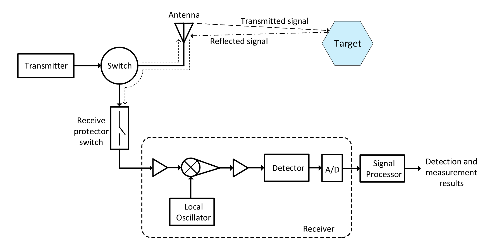{.r-stretch fig-align="center"}

## 目标识别和雷达范围

::: {.column width="50%"}

#### Radar parameter

$R=\frac{c\Delta T}{2}$, $v=\frac{\sqrt{R_{1}^{2}+R_{2}^{2}-2R_{1}R_{2}\cos\alpha}}{|t_{1}-t_{2}|}$

#### Radar range
$P_r=\frac{P_tG_tG_r\lambda^2\sigma F^4}{\left(4\pi\right)^3R^4}$

#### Range resolution

$\Delta R=\frac{c\tau}2$, $\Delta V=\frac{c}{2f_{c}T_{c}},$

:::

::: {.column width="5%"}

:::

::: {.column width="45%"}
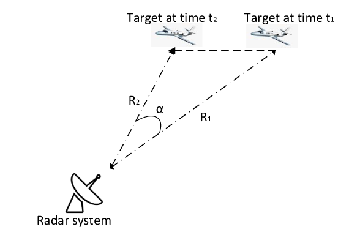{width=100%}

:::

#### Ambiguity function
$\mathcal{X}(\beta,f_D)=\int_{-\infty}^{+\infty}s(t)s^*(t-\beta)e^{i2\pi rf_D}dt$

## 联合雷达-通信方法

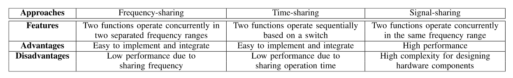{.r-stretch}

- 基于频分的方法: 这是JRC系统最简单的方法。具体来说，要同时使用雷达和通信功能，它们将被分配为在分开的天线上运行并以不同的频率传输。

- 基于时分的方法: 这也是用于将两个功能 (即，雷达和通信) 组合到一个系统中的简单解决方案。这种方法的关键思想是使用开关来选择和控制这两个功能的操作。特别是，对于这种方法，交换机将负责分别控制通信和雷达功能的操作。

- 双功能雷达通信系统: 这是JRC系统中使用的最流行的方法，尤其是在自治系统中，这主要是由于其出色的功能，例如低成本和频谱使用优化。这种方法的核心思想是将两种功能集成在相同的信号上进行传输。

# 雷达波形及处理

## FFCW 信号

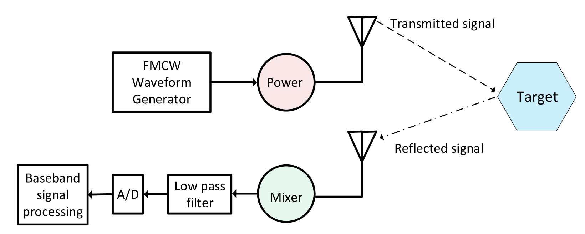{.r-stretch fig-align="center"}

::: {.fragment}
发射信号为：$s_{\mathrm{T}}(t)=A_{\mathrm{T}}\cos\biggl(2\pi f_{c}t+2\pi\int_{0}^{t}f_{\mathrm{T}}(\tau)d\tau\biggr)$

接收信号为：
$\begin{aligned}
s_{\mathrm{R}}(t)& =A_\text{R}\cos\Bigg(2\pi f_c(t-t_\text{d})+2\pi\int_0^tf_\text{R}(\tau)d\tau\Bigg) \\
&= A_{\mathrm{R}}\cos\biggl\{2\pi\biggl(f_{c}(t-t_{\mathrm{d}})+\frac{B}{T}\biggl(\frac{1}{2}t^{2}-t_{d}t\biggr)+f_{\mathrm{D}}t\biggr)\biggr\}
\end{aligned}$

:::

## FFCW 信号

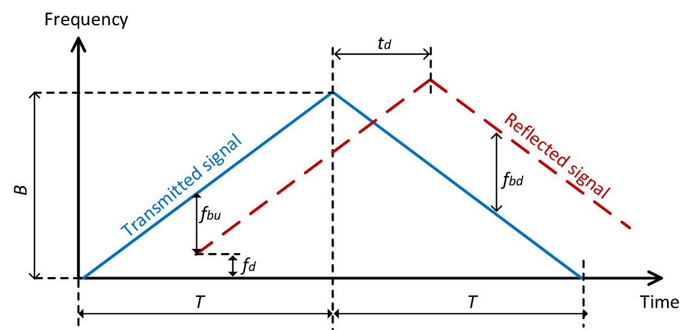{.r-stretch fig-align="center"}

经过混频，中频信号为：$s_{\text{IF}}(t)=\frac{1}{2}\cos\biggl(2\pi f_c\frac{2R_0}{c}+2\pi\biggl(\frac{2R_0}{c}\frac{B}{T}+\frac{2f_cv}{c}\biggr)t\biggr)$

并且 $v=\frac{(f_\mathrm{bu}+f_\mathrm{bd})c}{4f_c}$，$R_0=\frac{(f_\text{bu}-f_\text{bd})cT}{4B}$

## OFDM 信号

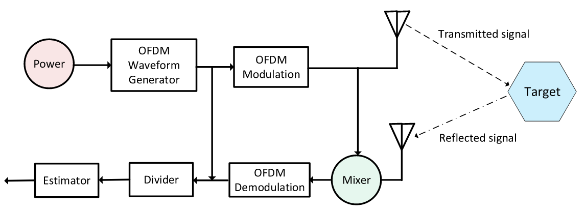{.r-stretch fig-align="center"}

发射信号为：$\begin{aligned}s(t)&=\sum_{\begin{array}{c}n=0\\\end{array}}^{N-1}\sum_{\begin{array}{c}m=0\\\end{array}}^{M-1}x_{m,n}\text{rect}(t-nT_\text{o})\times e^{j2\pi m\Delta f(t-T_\text{cp}-nT_\text{o})},\end{aligned}$

## JRC系统的潜在应用

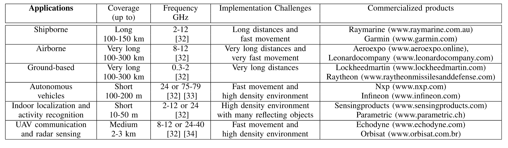{.r-stretch}

## 频谱共享

- 基于通信信号的方法: 这些方法使用诸如OFDM的标准通信信号用于雷达探测。
- 基于雷达信号的方法: 这些方法使用传统的雷达信号，如调频连续波传输通信符号。
- 时分方法: 这些方法分别为雷达和通信功能执行时间分配。这些方法的关键问题是如何优化雷达和通信性能之间的权衡。
- 空间波束成形方法: 这些方法为通信信号设计波束成形，然后将雷达信号投射到其信道的零空间中，到达通信接收器。

## 基于通信信号的方法

### 基于扩频的方案

这种方法的一般思想如下。首先，例如通过使用PSK调制将数据比特映射到数据符号中。然后，每个数据符号被调制，即与码序列 (例如m序列) 相乘。假定码序列在接收机处是已知的，例如通过使用同步方案。因此，雷达接收机和通信接收机可以分别通过使用基于相关算法的匹配滤波器来估计目标参数和检测数据符号。

## 基于通信信号的方法

### 基于OFDM的方案
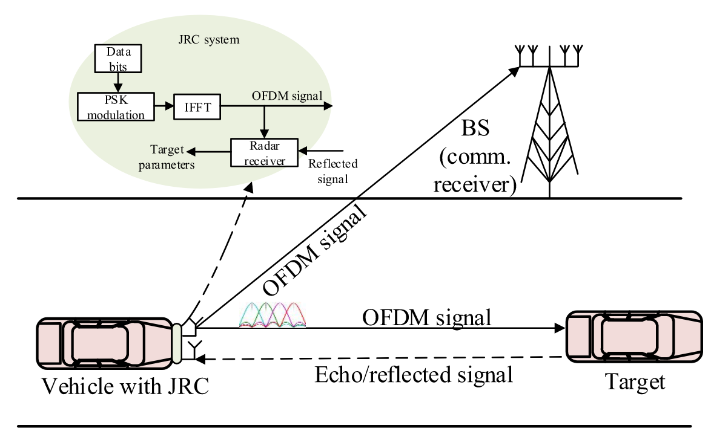{fig-align="center"}

## 基于通信信号的方法

### 基于OTFS的方案

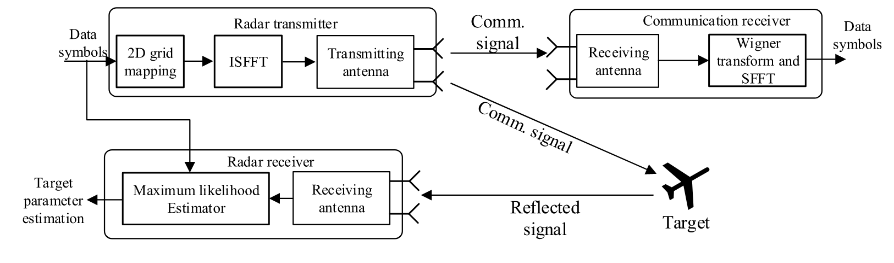{.r-stretch}

::: aside
Orthogonal Time-Frequency Space Modulation: A Promising Next-Generation Waveform

https://blog.csdn.net/weixin_39274659/article/details/124453739
:::

## 基于雷达信号的方法

### 基于跳频的方案

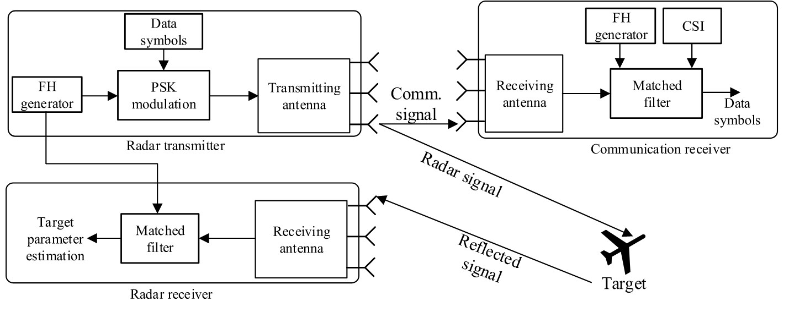  

## 基于雷达信号的方法

### 基于Chirp 信号的方法

除了FH信号之外，线性调频信号通常应用于雷达系统。chirp信号，也称为扫描信号，是一种频率随chirp速率增加或减少的信号 。在发射啁啾之前，雷达发射器执行所谓的啁啾调制、LFM或FMCW。从目标反射的回波信号由雷达接收机接收。然后，雷达接收机基于发射信号和回波信号之间的相位和频率差，例如通过匹配滤波器，估计目标的距离、速度和方向。通常，在使用FMCM的JRC中，线性调频带宽是影响雷达性能的重要因素。

## 基于时分复用的方法

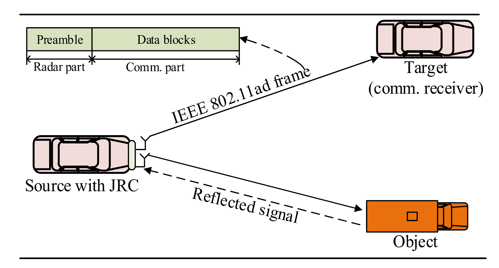  

## 基于波束成形的方法

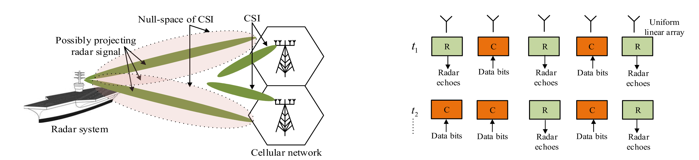  

这种方法通常用于共存的雷达和通信系统。关键思想是将雷达信号投射到其通信接收机信道的零空间中。

# JRC系统总的功率分配

## 多天线JRC系统

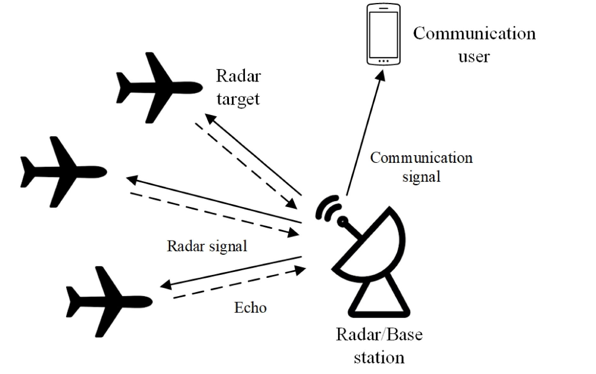{.r-stretch fig-align="center"}

其中多天线BS将数据发射到下行链路用户，同时在相同毫米波信道上同时检测多个雷达目标。为了最小化通信和雷达波束成形误差的总和，作者制定了一个加权波束成形器设计问题，该问题受非凸恒模约束和发射功率预算的约束。

## 多天线JRC系统

::: {.column width="50%"}
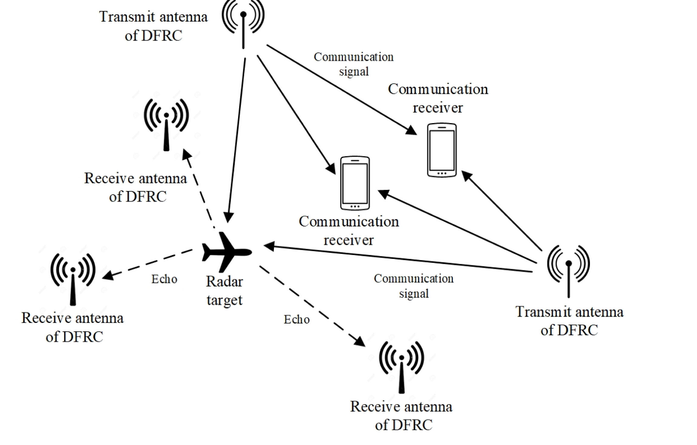

:::

::: {.column width="50%"}
与上述考虑共定位天线的工作不同，[122] 的作者考虑了一个通用的分布式DFRC系统，该系统同时服务于多个信号天线发射机，并检测具有空间分离的发射和接收天线的多个目标，如图14所示。设计目标是分别根据cramer-rao边界 (CRB) 和Shannon的容量实现定位精度和通信速率。为此，作者提出了一个问题，该问题确定了分布式DFRC发射机的功率分配，以最大程度地减少均方定位误差，同时要满足多个接收机的目标通信速率要求。作者证明了所提出问题的凸性，并采用标准的注水算法来获得最佳的功率分配解决方案。
:::

::: aside
Distributed dual-function radar-communication MIMO system with optimized resource allocation
:::

## 多天线JRC系统

参考文献^[Resource allocation for a wireless powered integrated radar and communication system] 考虑由RF能量收集^[Wireless networks with RF energy harvesting: A contemporary survey] 供电的DFRC发射器。具体地，DFRC发射器首先从无线功率信标采集RF能量，然后用作JRC基站。目标是在雷达和通信性能的约束下最小化功率信标的发射功率。

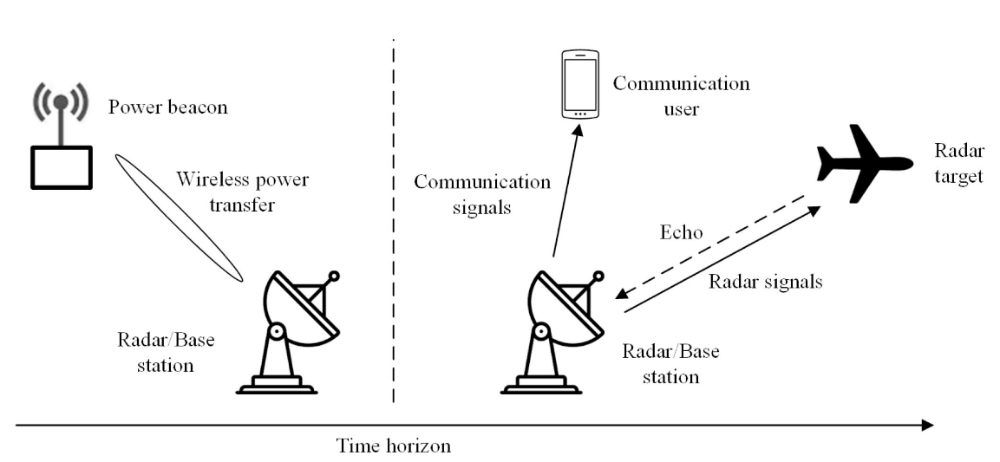{width="70%" fig-align="center"}

## CRC系统的功率分配

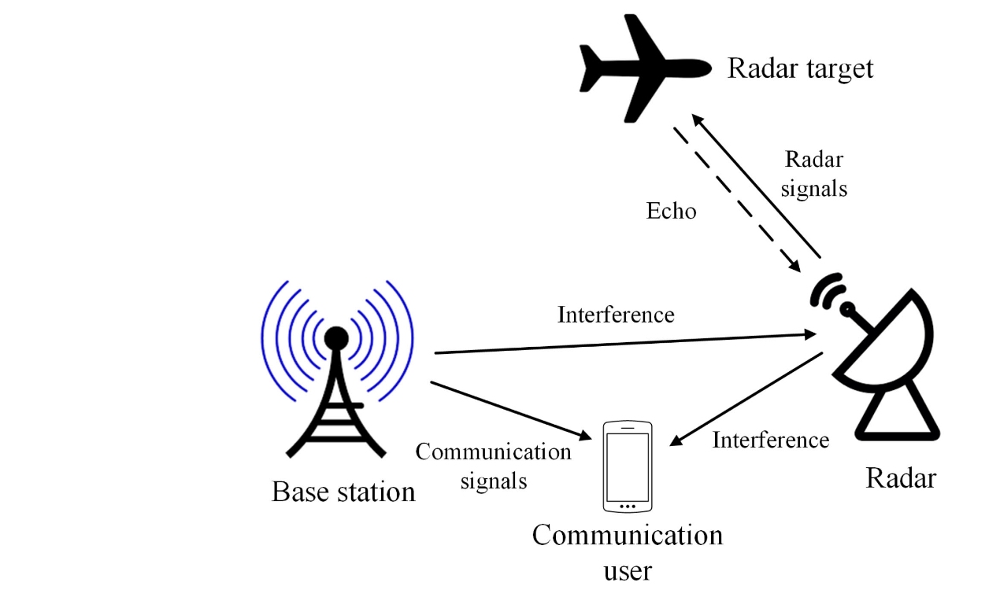{width="50%"}

CRC系统中的功率分配: 其中通信子系统在与雷达子系统相同的频带上操作，这显著提高了频谱效率。参考文献^[Joint transmit designs for coexistence of MIMO wireless communications and sparse sensing radars in clutter]考虑具有单个通信用户和雷达的CRC系统。为了使雷达SINR相对于受下行链路通信速率和功率限制的单个目标最大化，作者提出了一个问题，该问题确定了通信的发射协方差矩阵，雷达的发射预编码器，以及雷达子采样，以相对于下行链路通信速率和功率约束最大化雷达SINR。通过顺序凸规划技术解决该问题。

## Summary
- 基于率失真的最小均方误差是表征通信吞吐量与雷达参数估计精度之间权衡的常用度量。
- 通信的平均路径损耗与雷达的平均路径损耗之比在可以通过功率分配实现的最佳MI范围中起着关键作用。较大的比率通常表示可实现的MI的较大范围。
- 通过进一步利用空间分集，具有分布式天线的DFRC系统的性能优于具有并置天线的DFRC系统。
- 在现实系统中，可以在没有雷达目标的情况下估计环境杂波。杂波的负面影响可以通过预编码技术来减轻^[J. Nocedal and S. Wright, Numerical Optimization. New York, NY, USA: Springer, 2006.]。

# 干扰管理

由于频谱共享，雷达和通信子系统由于彼此施加的干扰而相互损害。干扰管理在通信和雷达子系统的性能中起着关键作用。与现有无线通信系统中的干扰管理主要侧重于减轻通信传输之间的干扰不同，JRC系统的目标是减轻雷达和通信子系统的交叉干扰。

## CRC 系统

从系统信息可用性的角度来看，CRC系统的设计可以分为三种类型: 非合作，合作和协同设计。对于非合作和合作类型的系统，在子系统之间有和没有信息交换的情况下设计了干扰管理方案。此外，协同设计的系统例如在波形和发射功率方面联合配置子系统。从设计目标的角度来看，干扰管理的研究可以分为两类: 通信接收机处的雷达干扰消除和雷达接收机处的通信干扰消除。

在雷达接收器处，除了雷达目标回波之外，存在从诸如建筑物和树木的其它物体反射的不想要的信号。这些不想要的信号被称为杂波，其被认为是要在雷达接收器处去除的干扰。

## DFRC 系统

在CRC系统中，交叉干扰是独立的，并且在每个单独的雷达和/或接收器处执行消除。不同地，在DFRC系统中，通信信号与雷达目标回波相关，因为它们来自相同的源。消除雷达目标回波中的通信信号涉及以原始形式重建接收到的信号，这比通信系统中的干扰消除更具挑战性，因为不精确地减去重建信号会导致更多的残留，从而导致雷达动态范围的严重下降，通过雷达处理一系列信号强度的能力来衡量。

## Summary

- 为了消除雷达干扰，最近提出的一种有效技术是将雷达波形投射到通信和雷达子系统之间的信道的零空间上。然而，对于不完善的CSI，零空间投影技术可能与损害检测性能的目标未对准。因此，为了使用这种技术，需要精确的CSI。
- 利用雷达波形的知识，通信系统可以通过直接减法技术来抑制雷达干扰。然而，如果波形信息在信息共享期间被干扰器拦截，则干扰信号可以被设计为损害雷达检测。因此，保护通信和雷达子系统之间的信息共享与干扰减轻设计一样重要。
- 在DFRC系统中，通信性能相当受整个系统中累积的同信道干扰的影响，而雷达性能主要受最强干扰源的限制^[Extension of the OFDM joint radar-communication system for a multipath, multiuser scenario]。
- 由于相互干扰，DFRC收发器必须配备足够的动态范围和模数分辨率，以确保数字化信号保持不失真的。
- 尽管更宽的天线方向性使雷达能够在更大的范围内进行检测，但由于干扰水平增加，总体可检测范围可能会减小。因此，应该考虑干扰减轻来适当地配置天线方向性。

# 挑战与未来研究方向

## 大规模访问和资源管理 {.scrollable}
JRC有望在具有高密度基站和移动设备的动态无线环境中实现。这在JRC系统中引发了大量的访问和资源管理问题。

- 大规模访问管理: 在雷达接收器使用目标的回波来检测目标。雷达接收机的问题是在存在噪声和干扰的情况下区分来自目标的回波和来自移动用户的通信信号。
- 与位置相关的资源管理: 除了来自大量移动用户的通信信号外，JRC系统的雷达和通信组件的空间位置在JRC性能中起着重要作用。但是，大多数现有文献都没有明确地对系统组件的位置进行建模。主要的挑战是理解移动性的影响 (例如，在雷达目标和通信接收器中)，其导致系统性能中的时间校正。不能适应动态位置变化的任何资源分配方案都将导致缺陷系统。因此，考虑移动性来设计依赖于位置的资源分配具有提高利用系统资源 (例如，频率、时间和能量) 的效率的巨大潜力。
- 大规模JRC系统的资源管理: 除了移动性之外，JRC系统的性能还受到在相同频带上运行的共存雷达、通信和JRC系统的空间分布的显著影响。此外，根据大型系统的空间分布来表征大型系统的影响是了解JRC性能和现实实现中资源管理设计的关键。随机几何 [163] 是建模和分析大型系统空间分布随机性的有力工具，可用于JRC系统的分析研究。
- 配备JRC的AVs的资源管理: 诸如DFRC之类的JRC一直是自动驾驶车辆 (即配备DFRC的av) 的有前途的技术。然而，一个主要问题是如何有效地调度DFRC的雷达功能和通信功能。其他类型的传感器，例如视频和激光雷达，在天气好的时候可以更有效地工作。AV的问题是确定最佳决策，即雷达模式或通信模式，以最大化雷达性能和通信性能。这是具有挑战性的，因为环境状态 (例如，天气和道路状态) 以及通信信道状态是动态的和不确定的。为了解决这个问题，可以开发诸如强化学习 (RL) 或深度强化学习 (DRL) 之类的学习算法，以允许AV快速获得最佳策略，而无需任何有关环境的先验信息。
- 具有激励机制的资源管理: 值得注意的是，配备DFRC的av实际上充当IoT设备，其感测周围环境 (例如，交通状况)，然后将感测数据传输到聚合单元 (例如，路边单元) 以供进一步处理。数据可以是具有大尺寸的图像或视频文件。因此，配备有dfrc的av可能需要来自服务提供商 (sp) 的大量频谱来同时执行雷达功能和通信功能。为了激励服务提供商和配备有DFRC的av参与频谱分配市场，问题在于增强服务提供商和配备有DFRC的av两者的效用。在这样一个多买方多卖方的市场中，Stackelberg博弈和匹配理论可以作为有效的解决方案，以最大化所有利益相关者的效用。

