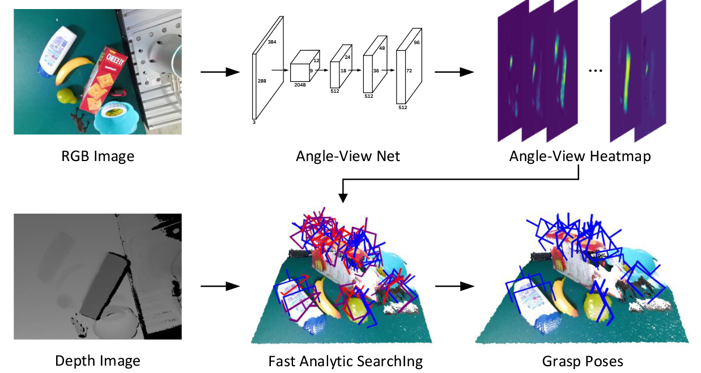
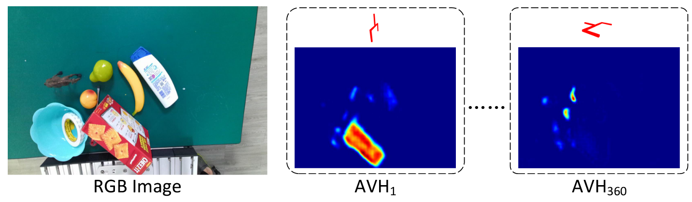
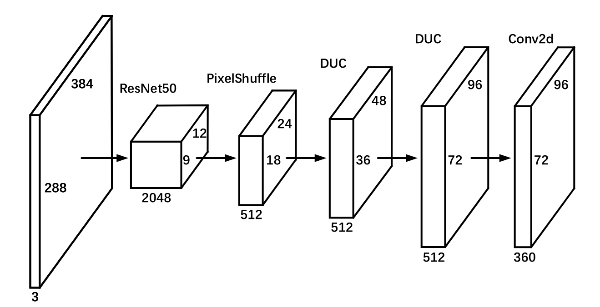
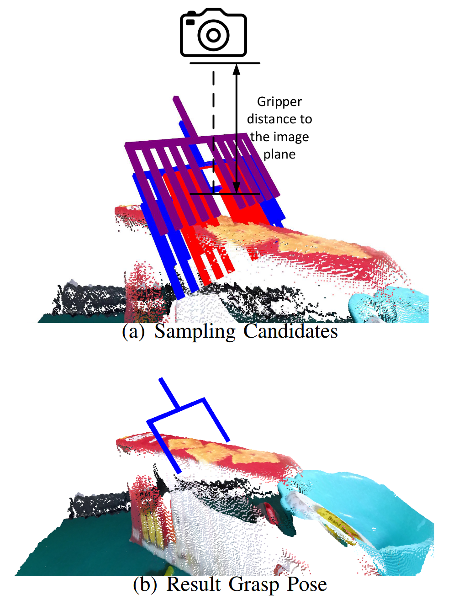
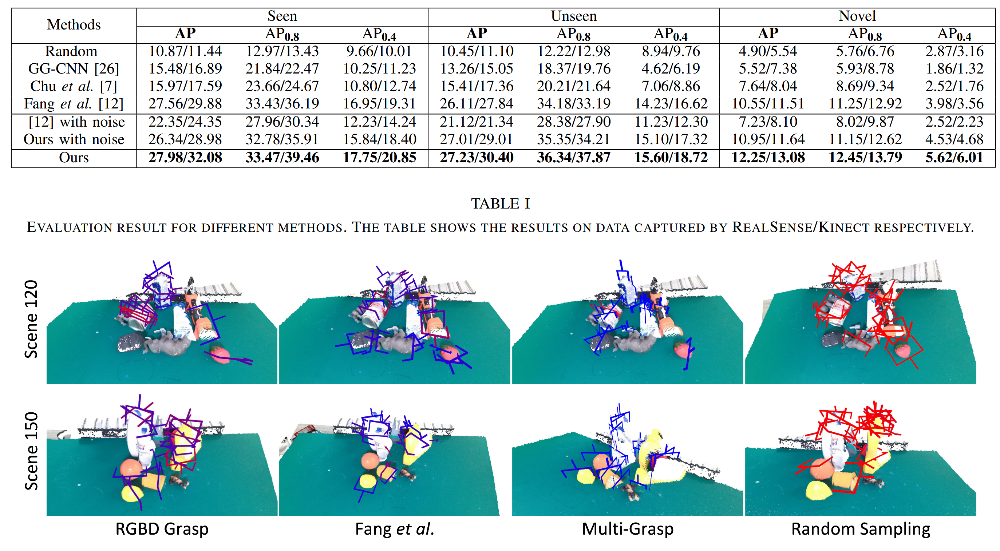

## 背景

抓取是机器人技术中的一个基本而重要的问题，是机器人操纵的基础。尽管这一问题至关重要，但解决这一问题的办法远远不能令人满意。

- [传统方法]{.alert} 利用物理分析来找到合适的抓握姿势。然而，这些方法需要不总是可用的精确对象模型。将这些算法应用于看不见的对象也很困难。此外，这些方法通常是耗时且计算昂贵的。
- 研究人员开始探索基于[数据驱动]{.alert}的方案。Fang等人 ^[GraspNet-1Billion: A LargeScale Benchmark for General Object Grasping]，Ni等人 ^[PointNet++ Grasping: Learning An End-to-end Spatial Grasp Generation Algorithm from Sparse Point Clouds] 和Mousavian等人 ^[6-dof graspnet: Variational grasp generation for object manipulation] 将RGBD摄像机捕获的部分视角点云馈送到神经网络，以获得6自由度的抓握姿势。然而，由于潜在的传感器故障，[深度数据与RGB数据相比不稳定]{.alert}。

## RGBD-Grasp

在本文中，我们介绍了[rgbd-grasp]{.alert}，这是一种7自由度的抓取检测管道。我们将单眼RGBD图像作为输入，并输出6自由度抓手姿势以及抓手的宽度作为附加自由度。

{fig-align="center"}

## 优势

- 这是使用单眼RGBD图像生成高DoF抓握姿势的首次尝试。RGB图像的使用使该方法更加稳定，并且高自由度的抓取姿势解决了平面限制的问题。
- 尽管该方法由两个阶段组成，但是每个阶段都有效地运行。在我们的实验中，它以10.5 FPS的速度运行，满足实时操作的要求。
- 得益于深度CNN和GraspNet-1Billion数据集的大规模数据 ^[GraspNet-1Billion: A LargeScale Benchmark for General Object Grasping]，该方法不仅可以很好地处理可见或相似的对象，而且还可以推广到新对象。

## 问题陈述

### Definitions

:::{.callout-note}

## Grasp Pose

$$
\mathcal{P} = (x,y,z,r_x,r_y,r_z,w)
$$
其中$x$、$y$和$z$表示夹具的平移，而$r_x$、$r_y$和$r_z$表示旋转，$w$表示相应的宽度。
:::

:::{.callout-note}

## RGBD Image

$$
\mathcal{I}=(\mathcal{C},\mathcal{D})
$$

$\mathcal{C}$ 是RGB图像，$\mathcal{D}$是深度信息。
:::

:::{.callout-note}

## Gripper Configuration

$$
\mathcal{G}=(h,l,w_{max})
$$
:::

## 问题陈述

### Problem Statement

令 $\mathcal{E}$ 表示包括机器人和物体的环境，并且 $s(\mathcal{E}，\mathcal{I}，\mathcal{G}，\mathcal{P})$ 表示指示抓握成功与否的二进制变量。如果物体被成功地举起，则抓握是成功的。给定RGBD图像 $\mathbf{I}$ 和抓取器配置G，我们的目标是找到一组抓取姿势 $\mathbf{P} = \{\mathcal{P}_1，\mathcal{P}_2，\cdots,\mathcal{P}_k\}$，在给定固定$k$的情况下最大化抓取成功率：
$$\{\mathcal{P}_1^*,\mathcal{P}_2^*,\cdots,\mathcal{P}_k^*\}=\text{argmax}\sum_{\begin{array}{c}|\mathbf{P}|=k\\\end{array}}\text{Prob}(s=1|\mathcal{E},\mathcal{I},\mathcal{G},\mathcal{P}_i).$$

## 方法

我们将问题分解为两个子问题。

- Angle-View Net (AVN) 在图像的不同位置生成抓取器方向：
  $$\mathcal{P}_{img}=(u,v,r_x,r_y,r_z,c)$$

- 我们收集那些具有高置信度分数的预测，并计算它们的宽度和到图像平面的距离，给定相机固有参数和基于Fast Analytic Searching (FAS) 的深度图像：
  $$\mathcal{P}_{cam}=(x,y,z,r_x,r_y,r_z,w)$$

## 方法

### Angle-View Net

{width="70%" fig-align="center"}

{width="60%" fig-align="center"}

## 方法
### Fast Analytic Searching

::: {.columns}

::: {.column width="40%"}
  

:::

::: {.column }
FAS模块的图示。上图: 点云由深度图像重建。对具有不同宽度和到图像平面的不同距离的候选者进行采样。我们对这些候选人进行碰撞和空检查。红色候选对象与场景点云碰撞，这违反了第一条规则。紫色的候选人在他们的抓取空间中没有意义，这违反了第二条规则。剩下的蓝色候选者被认为是良好的抓握姿势。下图: 在所有良好的抓握姿势中，我们进行抓握姿势非最大抑制，以找到距离最大，宽度最小的姿势。
:::
::: 

## 评估

  
