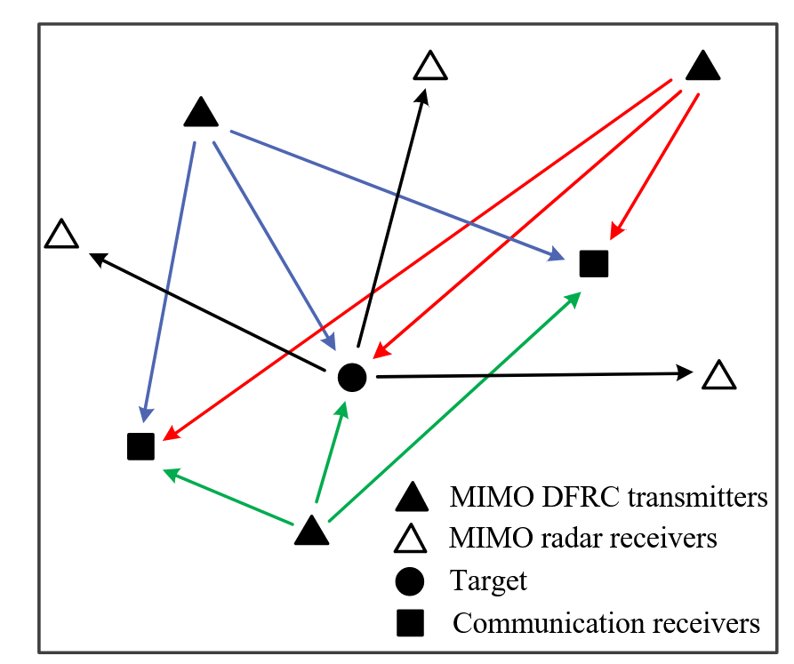
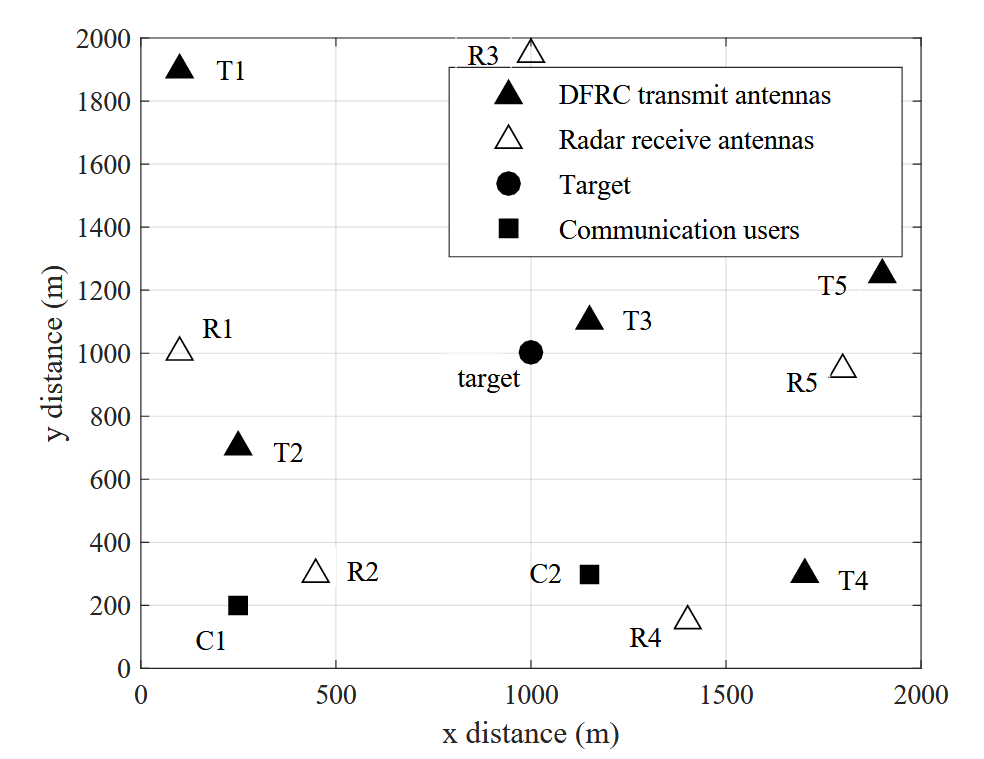
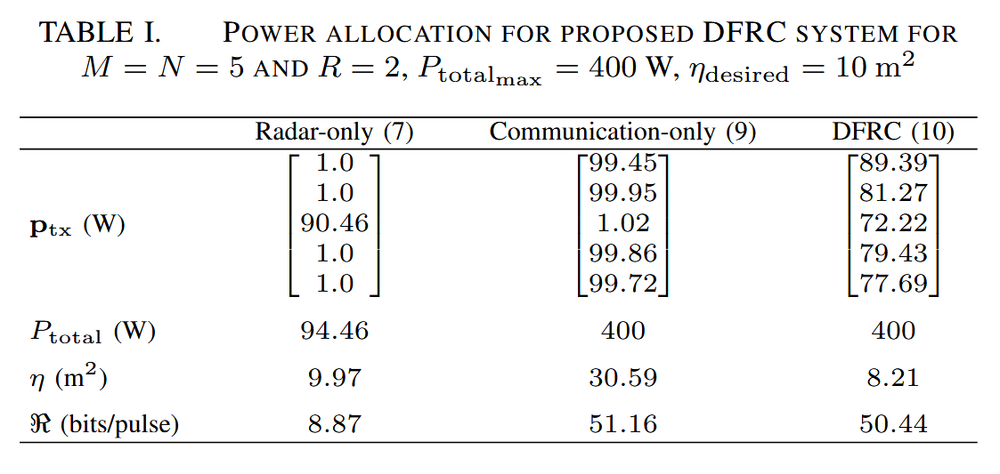

## 原论文引用信息

``` bibtex
@INPROCEEDINGS{8835674,
  author={Ahmed, Ammar and Zhang, Yimin D. and Himed, Braham},
  booktitle={2019 IEEE Radar Conference (RadarConf)}, 
  title={Distributed Dual-Function Radar-Communication MIMO System with Optimized Resource Allocation}, 
  year={2019},
  volume={},
  number={},
  pages={1-5},
  doi={10.1109/RADAR.2019.8835674}}
```

## 摘要

在本文中，我们提出了一种新颖的分布式双功能雷达通信 (DFRC) MIMO系统，该系统能够同时执行雷达和通信任务。雷达目标是实现期望的目标定位性能，而通信目标是优化整体数据速率。分布式DFRC MIMO系统通过优化DFRC系统中不同发射机的功率分配来实现这两个目标。在每个发射器处使用雷达波形的字典，并且通过利用波形分集将通信信息嵌入在雷达波形中。所提出的策略可以服务于位于分布式DFRC MIMO系统附近的多个通信接收器。仿真结果验证了所提策略的性能。

## 背景
在DFRC系统中，发射的波形服务于雷达和通信功能。雷达操作被认为是DFRC系统的主要目标，而通信操作被认为是次要目标。
最近的DFRC技术可以大致分为两大类。

- 第一类包括基于[波形分集]{.bg style="--col: #ef7a82"}的方法，其利用能够执行雷达操作的波形的字典。通过从字典中选择波形作来启用通信操作
- 第二类还采用基于[波束成形]{.bg style="--col: #ef7a82"}的空间复用技术来实现DFRC操作。

## 背景

已知具有广泛分布的天线的多输入多输出 (MIMO) 雷达系统由于增强的空间扩展而提供改进的定位能力。通过增加参与雷达的数量或发射能量，可以进一步提高分布式MIMO雷达的定位性能。
许多旨在提高定位精度的分布式MIMO雷达系统的案例都集中在基于cramer-rao边界 (CRB) 的资源软件方案。
资源感知设计对于网络中传感器节点的部署非常重要，以降低运营成本。
为了增强这些系统的性能，参与的雷达通常与地面站，融合中心或使用无线链路以分布式方式连接。因此，现代分布式雷达需要同时执行雷达和通信功能，同时考虑现场资源限制。[然而，对于分布式MIMO雷达架构的情况，DFRC方法尚未得到充分解决。]{.bg style="--col: #ef7a82"}

## 做了什么

提出了一种用于分布式MIMO雷达的新颖的资源感知DFRC策略。我们讨论了分布式DFRC MIMO系统的[最佳功率分配]{.bg style="--col: #ef7a82"}，以实现所需的目标定位和无线通信性能。定位精度是根据CRB来解决的，而通信性能是根据最佳香农容量来衡量的。仿真结果给出了分布式DFRC MIMO系统中每个发射机的最佳功率分配。

# 系统建模 {background-color="#40666e"}

## 雷达子系统 {.smaller}

::: {.columns}

::: {.column width="40%"}

:::

::: {.column width="60%"}
- 考虑一个窄带分布式MIMO雷达系统，由 $M$ 个发射机和 $N$ 个接收机组成，它们在二维 (2-D) 坐标系中任意地位于 $(x_m，y_m)$ 和 $(x_n，y_n)$
- 假设目标坐标为 $(x,y)$，其主要目的是跟踪目标位置。
- 在每个雷达脉冲期间，每个发射机辐射单位功率正交波形 $s_m(t)$，即有 $(1/T)\int_0^T|s_m(t)|^2dt=1$ 并且 $(1/T)\int_0^Ts_m(t)s_n^*(t)dt=0$ 对于 $m \neq n$ 成立。
- 第 $m$ 个发射机和第 $n$ 个接收机对应的雷达信号表示为: $s_{m,n}(t)=\sqrt{\alpha_{m,n}p_{m_{\mathrm{tx}}}}h_{m,n}s_m(t-\tau_{m,n})+w_{m,n}(t)$
:::

:::

## 雷达子系统 {.smaller}

可以根据代表均方误差下限的CRB来评估雷达性能：

$$\sigma_{x,y}(\mathbf{p}_{tx})=\frac{\mathbf{q}^T \mathbf{p}_{tx}}{\mathbf{p}_{tx}^T\mathbf{A}\mathbf{p}_{tx}}$$

其中 $\mathbf{q}=\mathbf{q}_a+\mathbf{q}_b$，$\mathbf{A}=\mathbf{q}_a\mathbf{q}_b^\mathrm{T}-\mathbf{q}_c\mathbf{q}_c^\mathrm{T}$, $\mathbf{q}_a = [q_{a_1},q_{a_2},\ldots,q_{a_M}]^\mathrm{T}$, $\mathbf{q}_b = [q_{b_1},q_{b_2},\ldots,q_{b_M}]^\mathrm{T}$, $\mathbf{q}_c = [q_{c_1},q_{c_2},\ldots,q_{c_M}]^\mathrm{T}$，$\xi_m = 8\pi^2\mathcal{B}_m^2/(\sigma_w^2c^2)$。

$$\begin{aligned}
&q_{a_m}= \xi_{m}\underset{n=1}{\sum}\alpha_{m,n}|h_{m,n}|^{2}\Bigg(\frac{x_{m}-x}{D_{m_{\mathrm{tx}}}}+\frac{x_{n}-x}{D_{n_{\mathrm{rx}}}}\Bigg)^{2}, \\
&q_{b_m}= \xi_{m}\underset{n\boldsymbol{=}1}{\sum}\alpha_{m,n}{\left|h_{m,n}\right|}^{2}{\left(\frac{y_{m}-x}{D_{m_{\mathrm{tx}}}}+\frac{y_{n}-x}{D_{n_{\mathrm{rx}}}}\right)}^{2}, \\
&q_{c_m}= \xi_{m}\underset{n=1}{\sum}\alpha_{m,n}{\left|h_{m,n}\right|}^{2}\Bigg(\frac{x_{m}-x}{D_{m_{\mathrm{tx}}}}+\frac{x_{n}-x}{D_{n_{\mathrm{rx}}}}\Bigg)\Bigg(\frac{y_{m}-x}{D_{m_{\mathrm{tx}}}}+\frac{y_{n}-x}{D_{n_{\mathrm{rx}}}}\Bigg)
\end{aligned}$$


## 通信子系统

考虑位于分布式DFRC MIMO系统附近的 $R$ 个通信接收器。[假设从雷达目标反射并在每个通信接收机处接收的信号与来自发射机的视线传输相比具有明显更低的幅度，因此被忽略]{.fg style="--col: #c3272b"}。
然后，我们可以将第$r$个接收器处的接收信号表示为

$$s_{m,r}(t)=\sqrt{\beta_{m,r}p_{m_{\mathrm{tx}}}}g_{m,r}s_{m}(t-\kappa_{m,r})+w_{m,r}(t)$$

根据所实现的香农容量来评估通信性能。从第 $m$ 个发射机到第 $r$ 个接收机的数据速率用香农的容量表示为:
$$\Re_{m,r}=\log_2\left(1+\frac{\left|g_{m,r}\right|^2p_{m_{\text{tx}}}}{\Gamma_{m,r}\sigma_{m,r}^2}\right)=\log_2\left(1+\frac{p_{m,\text{tx}}}{\gamma_{m,r}}\right)$$

# 分布式DFRC MIMO系统的最优功率分配 {background-color="#40666e"}

## 仅雷达操作 {.smaller}

仅雷达操作的最佳功率分配在^[Power allocation strategies for target localization in distributed multiple-radar architectures] 中得出:

$$\begin{aligned}&\text{minimize}&&\mathbf{1}_{1\times M}\mathbf{p}_{\mathrm{tx}}\\&\text{subject to}&&\mathbf{p}_{\mathrm{tx,min}}\leq\mathbf{p}_{\mathrm{tx}}\leq\mathbf{p}_{\mathrm{tx,max}}\\&&&\sigma_{x,y}(\mathbf{p}_{\mathrm{tx}})=\eta.\end{aligned}$$

[优化使分布式MIMO雷达的总发射功率最小化，使得实现根据crbn描述的期望的定位精度。]{.bg style="--col: #ef7a82"}

上式可以被宽松为：

$$\begin{aligned}&\text{minimize}&&\mathbf{1}_{1\times M}\mathbf{p}_{\mathrm{tx}}\\&\text{subject to}&&\mathbf{p}_{\mathrm{tx,min}}\leq\mathbf{p}_{\mathrm{tx}}\leq\mathbf{p}_{\mathrm{tx,max}}\\&&&\mathbf{q}-\eta\mathbf{A}\mathbf{p}_{\mathrm{tx}}\leq\mathbf{0}.\end{aligned}$$

其可以用作应用于原始优化的局部优化的起始点。

## 仅通信系统 {.smaller}

我们假设从每个发射机发送的波形被广播到位于DFRC发射机附近的所有通信用户。我们假设信道边信息在DFRC发射机和通信接收机处是已知的。因此，我们通过利用传统的[注水法](https://levitate-qian.github.io/2021/05/03/Wireless-Communications-Ch-4/)来优化功率分配^[A. Goldsmith, Wireless Communications, Cambridge University Press, 2005]。对于所有通信接收机，通过同时求解以下等式来实现最大允许发射功率的最佳:

$$\mathbf{U}\left[\begin{array}{c}\mathbf{p}_{\mathrm{tx}}\\X_{r}\end{array}\right]=\left[\begin{array}{c}P_{\mathrm{total}_{\mathrm{max}}}\\\mathbf{\gamma}_{r}\end{array}\right]$$

其中
$$\left.\mathbf{U}=\left[\begin{array}{cc}\mathbf{1}_{1\times M}&0\\\mathbf{I}_{M\times M}&-\mathbf{1}_{1\times M}^\mathrm{T}\end{array}\right.\right],\quad\boldsymbol{\gamma}_r=-\left[\begin{array}{c}\gamma_{1,r}\\\gamma_{2,r}\\\vdots\\\gamma_{M,r}\end{array}\right]$$

其中 $X_r$ 表示注水功率水平。

## 仅通信系统 
可以根据不同的通信用户的信道边信息为不同的通信用户提供不同的最佳功率分配。此外，方程的解如果任何信道具有深衰落，也可以提供负功率。因此，我们可以对于所有的通信接收机为以下约束最小二乘优化问题：

$$\begin{aligned}
\text{minimize}\quad  &\sum_{r=1}^R\left|\mathbf{V}\left[\begin{array}{c}\mathbf{p}_\mathrm{tx}\\X_r\end{array}\right]-\boldsymbol{\gamma}_r\right|_2\\
\text{subject to}\quad &\mathbf{p}_{\mathrm{tx,min}}\leq\mathbf{p}_{\mathrm{tx}}\leq\mathbf{p}_{\mathrm{tx,max}},\\&\mathbf{1}^{\mathrm{T}}\mathbf{p}_{\mathrm{tx}}\leq P_{\mathrm{total}_{\mathrm{max}}},\\&X_r\geq0,\quad r=1,2,\ldots,R,\end{aligned}$$ {#eq-comm-opt}

## 双功能雷达-通信

我们可以在优化问题 @eq-comm-opt 中加入雷达性能约束，得到如下修正凸优化问题:

$$\begin{aligned}
\text{minimize}\quad  &\sum_{r=1}^R\left|\mathbf{V}\left[\begin{array}{c}\mathbf{p}_\mathrm{tx}\\X_r\end{array}\right]-\boldsymbol{\gamma}_r\right|_2\\
\text{subject to}\quad &\mathbf{p}_{\mathrm{tx,min}}\leq\mathbf{p}_{\mathrm{tx}}\leq\mathbf{p}_{\mathrm{tx,max}},\\&\mathbf{q}-\eta\mathbf{Ap}_\mathrm{tx}\leq\mathbf{0}\\&\mathbf{1}^{\mathrm{T}}\mathbf{p}_{\mathrm{tx}}\leq P_{\mathrm{total}_{\mathrm{max}}},\\&X_r\geq0,\quad r=1,2,\ldots,R,\end{aligned}$$

# 信息嵌入 {background-color="#40666e"}

## {.smaller}

信息嵌入可以通过利用波形分集来完成。如果为每个发射器分配K个雷达波形的字典，则在一个雷达脉冲期间从分布式DFRC MIMO系统发送的总比特为 $M \log_2 K$，前提是字典不重叠并且所有发射器都处于活动状态。
在通信接收器r处接收的信号可以表示为:
$$\begin{aligned}
s_r(t)& =\sum_{m=1}^Ms_{m,r}(t) \\
&=\sum_{m=1}^M\sqrt{\beta_{m,r}p_{m_{\mathrm{tx}}}}g_{m,r}s_m(t-\kappa_{m,r})+w_r(t)
\end{aligned}$$

可以在通信接收器处利用匹配滤波来通过馈送时间延迟版本来合成嵌入的信息:
$$\begin{aligned}
y_r(k)& =\frac{1}{T}\int_0^Ts_r(t+k\Delta t)s_m^*(t)dt \\
&=\left\{\begin{array}{ll}\sqrt{\beta_{m,r}p_{m_{\text{tx}}}}g_{m,r}+w_{r,k}(t),&\text{if }s_m(t)\text{ transmitted,}\\w_{r,k}(t),&\text{otherwise,}\end{array}\right.
\end{aligned}$$


## 仿真

::: {.columns}
::: {.column width="40%"}
  

:::
::: {.column width="60%"}
  

:::
:::
